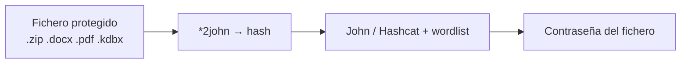

---
tags:
  - Seguridad/Contraseñas
  - Pentesting/Post-Explotacion
Descripción: "Durante el credential hunting aparecen constantemente ficheros protegidos por contraseña — un backup.zip, un Passwords.xlsx, una clave SSH cifrada"
Fecha de actualización: 2026-07-18
Nota previa: "[[01 - Wordlists y reglas personalizadas]]"
Nota siguiente: "[[03 - Ataques remotos a servicios de red]]"
Area: "[[Ataques a contraseñas.base|Ataques a contraseñas]]"
---
---

Durante el [[10 - Credential hunting en Windows|credential hunting]] aparecen constantemente ficheros protegidos por contraseña — un `backup.zip`, un `Passwords.xlsx`, una clave SSH cifrada. <mark style="background: #ADCCFFA6;">El patrón para abrirlos es siempre el mismo: extraer un hash del fichero con un `*2john` y crackearlo</mark>.

# El patrón universal



Los [[01 - Cracking en la práctica con John|*2john]] vienen con John Jumbo; convierten el material cifrado en una línea de hash que John o Hashcat pueden atacar.

# Documentos ofimáticos

```shell-session
$ office2john Confidencial.xlsx > doc.hash      # docx, xlsx, pptx
$ john --wordlist=/usr/share/wordlists/rockyou.txt doc.hash

$ pdf2john informe.pdf > pdf.hash
$ john pdf.hash --wordlist=rockyou.txt
```

# Archivos comprimidos

```shell-session
$ zip2john backup.zip > zip.hash
$ john --wordlist=rockyou.txt zip.hash

$ rar2john secret.rar > rar.hash
$ 7z2john archive.7z > 7z.hash
```

# Otros contenedores

```shell-session
$ keepass2john Database.kdbx > keepass.hash     # gestor de contraseñas
$ bitlocker2john -i disk.img > bitlocker.hash    # volumen cifrado (emite varias líneas $bitlocker$0/1/2/3; recovery key de 48 díg → máscara -a 3, no wordlist)
$ ssh2john id_rsa > ssh.hash                      # clave privada con passphrase
```

<mark style="background: #FF5582A6;">Una base de KeePass crackeada es el premio gordo</mark>: dentro suele haber decenas de credenciales en claro ([[16 - Políticas y gestores de contraseñas|gestores de contraseñas]]).

# Con Hashcat (por GPU)

Para ficheros con hash lento o volumen alto, Hashcat con GPU es más rápido — cada tipo tiene su `-m`:

| Fichero | `-m` |
| --- | --- |
| MS Office 2013+ | `9600` |
| PDF (según versión) | `10400`–`10700` |
| WinZip | `13600` |
| 7-Zip | `11600` |
| KeePass | `13400` |
| BitLocker | `22100` |

```shell-session
$ hashcat -m 13400 keepass.hash /usr/share/wordlists/rockyou.txt -r best64.rule
```

> [!warning]+ KeePass moderno (Argon2/KDBX4) exige hashcat ≥7.0
> Las bases KeePass 2.x creadas desde ~2017 usan **Argon2** como KDF por defecto (formato KDBX4). Hashcat solo soporta Argon2/KDBX4 desde la **serie 7.0+**; John Jumbo, desde nov-2024. Con una build vieja de la VM de ataque, `-m 13400` falla o da falsos negativos silenciosos contra esas bases — comprueba `hashcat --version` si un `.kdbx` "no cae".

> [!warning]+ Formatos lentos, wordlist afilada
> <mark style="background: #FFB8EBA6;">KeePass, BitLocker y Office moderno usan derivación de clave **deliberadamente lenta**</mark> (miles de iteraciones): la fuerza bruta es inviable. Contra ellos, ataca con una wordlist **dirigida** ([[01 - Wordlists y reglas personalizadas|cewl + reglas]]) y candidatos plausibles, no con `?a?a?a?a?a`. La calidad de la lista importa más que la potencia bruta.

Con el cracking offline cubierto, pasamos a la otra mitad: los [[03 - Ataques remotos a servicios de red|ataques online contra servicios]].
