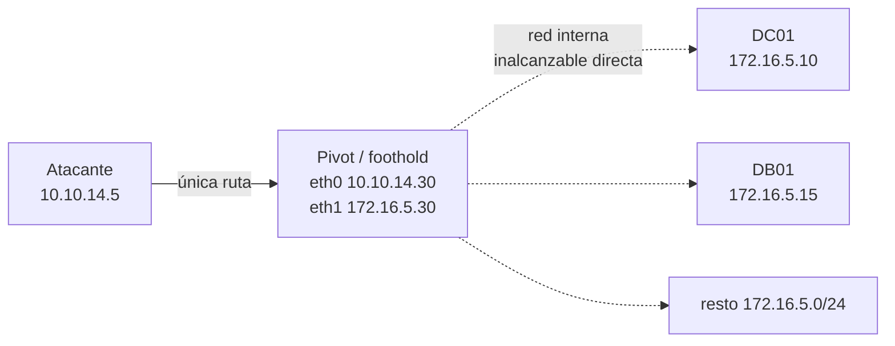

---
tags:
  - Pivoting
  - Pentesting/Movimiento-Lateral
  - Introduccion
  - Tipo/Introduccion
Descripción: "Comprometer el primer host casi nunca es el objetivo — es la puerta"
Fecha de actualización: 2026-07-19
Nota previa: 
Nota siguiente: "[[01 - Fundamentos de red del pivoting]]"
Area: "[[Pivoting y túneles.base|Pivoting y túneles]]"
---
---

Comprometer el primer host casi nunca es el objetivo — es la **puerta**. Ese host suele tener un pie en tu red y otro en una red interna segmentada que no alcanzas directamente: ahí viven los DC, las bases de datos y el dato del cliente. <mark style="background: #ADCCFFA6;">Pivotar es convertir ese primer *foothold* en un trampolín para llegar a lo que estaba fuera de alcance.</mark>

El host del medio es **dual-homed** (dos interfaces, dos redes). Tú ves el `10.10.14.0/24`; el pivot ve *además* el `172.16.5.0/24`. Todo el módulo trata de **enrutar tu tráfico a través de ese pivot** para hablar con la red interna como si estuvieras dentro.

# Tres términos que se confunden

Se usan indistintamente en las charlas de pasillo, pero son cosas distintas — y separarlas ordena el módulo entero:

| Término | Qué es | Ejemplo |
| --- | --- | --- |
| <mark style="background: #ADCCFFA6;">**Pivoting**</mark> | La *estrategia*: usar un host comprometido para alcanzar redes que no ves | Saltar de la DMZ a la LAN interna |
| <mark style="background: #ADCCFFA6;">**Tunneling**</mark> | El *transporte*: encapsular tu tráfico dentro de otro protocolo para atravesar u ocultar | SOCKS sobre SSH; C2 sobre DNS |
| <mark style="background: #ADCCFFA6;">**Port forwarding**</mark> | La *primitiva*: redirigir un puerto concreto de un host a otro | Exponer el `3389` interno en tu `localhost` |

<mark style="background: #8000E1A6;">Dicho de otro modo: pivotas *usando* túneles y port forwards como herramientas.</mark> Un mismo objetivo —llegar al `445` de `DB01`— se resuelve con un port forward puntual, con un proxy SOCKS que enruta todo, o con un túnel cifrado que además evade inspección. Elegir cuál depende de cuántos servicios necesitas, qué egress permite el pivot y cuánto sigilo exige el `engagement`.

# Por qué importa (y dónde encaja en el pentest)

Las redes serias están **segmentadas**: el host que expones a Internet (web, VPN, correo) no es el que guarda el oro. El acceso inicial te deja en el borde; <mark style="background: #FFB86CA6;">el pivoting es lo que convierte "una web comprometida" en "dominio comprometido"</mark>. Es la bisagra entre el [[00 - Introducción a shells y payloads|acceso inicial]] y el movimiento lateral hacia Active Directory: sin ruta a la red interna, tus credenciales robadas y tus exploits no tienen contra qué dispararse.

Encaja en la fase de **[[14 - Pass the Ticket (PtT)|movimiento lateral]]** / post-explotación. El flujo típico:

1. Comprometes un host expuesto → shell.
2. Enumeras sus interfaces y descubres una segunda red ([[01 - Fundamentos de red del pivoting]]).
3. Montas el pivot (port forward, SOCKS o túnel) para enrutar hacia esa red.
4. Escaneas y atacas la red interna **a través** del pivot, como si estuvieras conectado a ella.

# El terreno del módulo

El recorrido va de la primitiva al arte:

- **El pilar**: port forwarding con SSH — [[02 - Local y dynamic port forwarding con SSH|local/dynamic]] y [[03 - Remote port forwarding con SSH|remoto]] — más [[04 - Tunneling con Meterpreter|Meterpreter]] y [[05 - Redirección de tráfico con Socat|Socat]].
- **Por SO y utilidad**: [[06 - SSH en Windows con plink|plink]], [[07 - Pivoting con sshuttle|sshuttle]], [[08 - Port forwarding en Windows con netsh|netsh]].
- **Túneles avanzados / covert**: [[09 - SOCKS tunneling con Chisel|Chisel]], [[10 - DNS tunneling con dnscat2|DNS]], [[11 - ICMP tunneling|ICMP]], [[12 - RDP tunneling con SocksOverRDP|RDP]].
- **El estado del arte (net-new)**: [[13 - Pivoting moderno con Ligolo-ng|Ligolo-ng]], que en 2026 desplaza a buena parte de lo anterior, más la [[15 - Detección y evasión de túneles|detección/evasión]] y el [[16 - Arsenal de herramientas de pivoting|arsenal]].

> [!warning]+ El material clásico de este tema está desactualizado
> Muchos tutoriales (y el propio módulo base) siguen anclados en `proxychains` + SSH `-D` + `chisel` como si fuera 2019. Funcionan, y hay que dominarlos porque son universales — pero <mark style="background: #FF5582A6;">para pivoting serio en 2026 el flujo por defecto es `ligolo-ng`</mark> (interfaz TUN, sin el lastre de `proxychains`). Este sub-tema enseña los fundamentos *y* señala en cada punto la vía moderna.

Una vez montado el túnel, mover ficheros por él es directo — ahí se enlaza con [[11 - Arsenal de herramientas|el arsenal de transferencias]], que asume justo este transporte por debajo. El pivoting es la primera de las seis actividades del ciclo de [[09 - Movimiento lateral]], que encuadra cuándo y por qué se recurre a él dentro del engagement.
