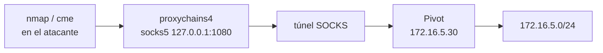

---
tags:
  - Pivoting
  - Pentesting/Movimiento-Lateral
  - Redes
  - Tipo/Introduccion
Descripción: "Antes de tunelizar nada, mapeas dónde estás"
Fecha de actualización: 2026-07-19
Nota previa: "[[00 - Introducción al pivoting y los túneles]]"
Nota siguiente: "[[02 - Local y dynamic port forwarding con SSH]]"
Area: "[[Pivoting y túneles.base|Pivoting y túneles]]"
---
---

Antes de tunelizar nada, **mapeas dónde estás**. La configuración de red del propio pivot te dice qué redes alcanza — y por tanto hacia dónde puedes saltar. Saltarse este paso es montar túneles a ciegas.

# Descubrir tu posición: interfaces y rutas

Lo primero en el host comprometido: ¿cuántas patas tiene?

```shell-session
# Linux
victim$ ip -brief addr        # o ifconfig
eth0   UP   10.10.14.30/24
eth1   UP   172.16.5.30/24    # <-- segunda red: el objetivo del pivot
victim$ ip route              # qué redes enruta directamente
```

```cmd
:: Windows
C:\> ipconfig /all
C:\> route print
```

<mark style="background: #ADCCFFA6;">Una segunda interfaz en un rango distinto (`172.16.5.0/24`) es la señal de un host dual-homed</mark> y tu vía a la red interna. Si solo hay una interfaz pero la tabla de rutas apunta a otras redes vía un gateway, esa ruta también es pivotable.

# Vecinos: ARP, conexiones y nombres

El pivot ya ha hablado con la red interna — su caché te regala hosts vivos sin escanear (y sin ruido):

```shell-session
victim$ arp -a                       # vecinos L2 con los que ya conversó
victim$ ss -tulpn                    # servicios a la escucha + conexiones (ss > netstat)
victim$ cat /etc/hosts               # nombres internos cableados a mano
```

<mark style="background: #FFB86CA6;">La tabla ARP y las conexiones establecidas son *inteligencia gratis*</mark>: revelan qué hosts internos existen y con cuáles el pivot ya tiene relación de confianza, antes de lanzar un solo paquete de escaneo.

# El proxy SOCKS: el caballo de batalla

<mark style="background: #ADCCFFA6;">Un proxy SOCKS reenvía conexiones TCP arbitrarias (SOCKS5 también UDP) sin que a la aplicación le importe</mark>. Es la pieza central del pivoting: en vez de un port forward por cada servicio, levantas **un** proxy SOCKS en el pivot y *todas* tus herramientas —`nmap`, `crackmapexec`, `curl`, el navegador— alcanzan la red interna a través de él.

El pegamento en el host de ataque es `proxychains` (usa la fork mantenida, **proxychains-ng** / `proxychains4`). Su config apunta al puerto SOCKS que abrió tu túnel:

```shell-session
# /etc/proxychains4.conf  (última línea)
socks5 127.0.0.1 1080

$ proxychains4 -q nmap -sT -Pn -p445,3389,5985 172.16.5.15
$ proxychains4 -q crackmapexec smb 172.16.5.0/24
```



> [!warning]+ Los límites de SOCKS/proxychains (por qué luego aparece Ligolo)
> - **Solo TCP connect**: `nmap` por proxychains obliga a `-sT` (no `-sS`) y `-Pn` — no hay SYN-scan ni ping. Escanear así es **lento** y ruidoso.
> - **Sin ICMP**: no puedes `ping` a través del proxy; herramientas que dependen de ICMP fallan.
> - **Frágil con UDP** y con aplicaciones que abren conexiones raras.
> <mark style="background: #FF5582A6;">Estas fricciones son justo lo que resuelve el enfoque TUN de [[13 - Pivoting moderno con Ligolo-ng|Ligolo-ng]]</mark>, que expone la red interna como una interfaz local y deja usar `nmap -sS`, `ping` y cualquier herramienta sin proxychains.

# Rutas estáticas: enrutar hacia la red interna

La alternativa al proxy es **enrutar** una red entera hacia el pivot, para que tu SO mande ahí el tráfico de `172.16.5.0/24` sin envolver cada herramienta:

```shell-session
$ sudo ip route add 172.16.5.0/24 via 10.10.14.30
```

Rara vez se hace a mano: <mark style="background: #8000E1A6;">herramientas como el `autoroute` de [[04 - Tunneling con Meterpreter|Meterpreter]] o [[07 - Pivoting con sshuttle|sshuttle]] automatizan justo esta inyección de rutas</mark>, dando la sensación de estar "dentro" de la red interna sin tocar proxychains.

# El reflejo antes de tunelizar

Cuatro preguntas ordenan la decisión del resto del módulo:

1. **¿Qué redes ve el pivot?** (`ip a`, `route print`) → define el destino.
2. **¿Qué hosts internos ya conoce?** (`arp -a`, `ss`) → objetivos sin escanear.
3. **¿Necesito muchos servicios o uno?** → SOCKS (todo) vs port forward (puntual).
4. **¿Qué egress permite el pivot?** → decide el transporte: SSH (`22`), HTTPS (`chisel`/`ligolo`), o covert (DNS/ICMP) si todo lo demás está capado.

Con el mapa claro, el primer transporte —y el más universal— es SSH: [[02 - Local y dynamic port forwarding con SSH]].
