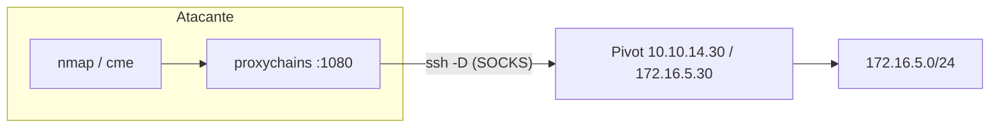

---
tags:
  - Pivoting
  - Pentesting/Movimiento-Lateral
  - Linux
Descripción: "SSH es el pivot universal: está en casi todo, va cifrado, y solo necesita credenciales (o clave) y el 22 accesible"
Fecha de actualización: 2026-07-19
Nota previa: "[[01 - Fundamentos de red del pivoting]]"
Nota siguiente: "[[03 - Remote port forwarding con SSH]]"
Area: "[[Pivoting y túneles.base|Pivoting y túneles]]"
---
---

SSH es el pivot **universal**: está en casi todo, va cifrado, y solo necesita credenciales (o clave) y el `22` accesible. Con dos modos cubres la mayoría de escenarios — `-L` para *un* servicio interno, `-D` para *toda* la red vía SOCKS. Es la [[SSH#Relevancia ofensiva|relevancia ofensiva de SSH]] llevada al pivoting.

# Local port forwarding (`-L`)

Trae un servicio interno **a tu localhost**. Sintaxis: `-L [bind:]lport:destino:dport`, ejecutado desde el atacante contra el pivot:

```shell-session
# localhost:3390 -> (por el pivot) -> 172.16.5.15:3389
attacker$ ssh -L 3390:172.16.5.15:3389 ubuntu@10.10.14.30 -N
attacker$ xfreerdp /v:127.0.0.1:3390 /u:admin
```

<mark style="background: #ADCCFFA6;">Tu `127.0.0.1:3390` queda conectado, a través del túnel SSH, al `3389` de un host interno que no ves directamente</mark>. Puedes encadenar varios `-L` en un solo comando (uno por servicio). Flags clave: `-N` (no abrir shell, solo el túnel), `-f` (a segundo plano), `-C` (compresión). Por defecto `-L` bindea el puerto a `127.0.0.1`; para que otra máquina o VM use tu puerto reenviado, expónlo con `-L 0.0.0.0:3390:172.16.5.15:3389` (o el flag `-g`).

# Dynamic port forwarding (`-D`) → un proxy SOCKS

En vez de un puerto fijo, `-D` levanta un **proxy SOCKS** en tu máquina que alcanza *cualquier* host que el pivot pueda ver:

```shell-session
attacker$ ssh -D 1080 ubuntu@10.10.14.30 -N -f
# ahora 127.0.0.1:1080 es un SOCKS a toda la red del pivot
attacker$ proxychains4 -q nmap -sT -Pn -p445,3389 172.16.5.0/24
attacker$ proxychains4 -q crackmapexec smb 172.16.5.15 -u user -p pass
```

<mark style="background: #FFB86CA6;">Es el modo caballo de batalla</mark>: un solo comando y toda tu suite de herramientas enruta hacia la red interna por [[01 - Fundamentos de red del pivoting|proxychains]] (recuerda `-sT`/`-Pn` en nmap por las limitaciones de SOCKS).



# `-L` vs `-D`: cuál usar

| | `-L` (local) | `-D` (dynamic) |
| --- | --- | --- |
| Alcance | **Un** `destino:puerto` fijo | **Cualquier** host que vea el pivot |
| Mecanismo | Port forward directo | Proxy **SOCKS** |
| Cliente | Apunta a `127.0.0.1:lport` | Va vía `proxychains` |
| Cuándo | Necesito 1-2 servicios concretos | Voy a **explorar** toda la red interna |

<mark style="background: #8000E1A6;">Regla: si sabes exactamente a qué servicio vas, `-L`; si vas a moverte por la red, `-D`.</mark> Para el sentido inverso —cuando no puedes conectar *hacia* el pivot pero él sí hacia ti— entra `-R`: [[03 - Remote port forwarding con SSH]].
