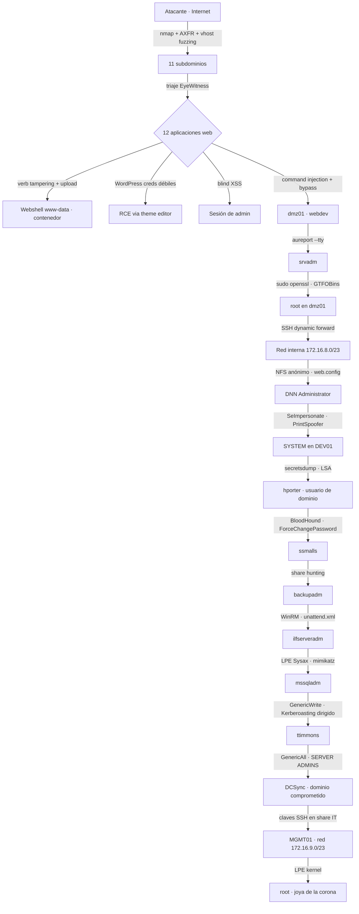

---
tags:
  - Pentesting
  - Redes-Empresariales
  - Tipo/Introduccion
Descripción: "Cómo se encadena un pentest real de perímetro a compromiso de dominio, y por qué el valor está en las transiciones entre técnicas, no en las técnicas sueltas"
Fecha de actualización: 2026-07-31
Nota previa: 
Nota siguiente: "[[01 - Escenario, alcance y arranque del engagement]]"
Area: "[[Ataque a redes empresariales.base|Redes empresariales]]"
---
---

Las notas de este sub-tema recorren un **engagement completo** contra una red empresarial simulada (`Inlanefreight`), desde el correo de inicio de pruebas hasta el compromiso del dominio y la red de gestión. No repiten las técnicas —cada una vive en su nota— sino que muestran <mark style="background: #ADCCFFA6;">el pegamento entre ellas: por qué se elige un camino, qué se hace cuando no lleva a ningún sitio y cómo un hallazgo alimenta el siguiente</mark>.

Es la diferencia entre saber ejecutar `Kerberoasting` y saber **cuándo** intentarlo, con qué cuenta, y qué hacer con el hash si la contraseña no cae.

# Lo que hace difícil un engagement real

Dominar veinte técnicas por separado no prepara para lo que ocurre en un proyecto de una semana contra una red desconocida. Lo que cuesta es otra cosa:

- **Cambiar de contexto sin perder el hilo.** En un mismo día se pasa de OSINT a fuzzing web, de ahí a inyección de comandos, a escalada Linux, a pivoting, a Active Directory y de vuelta a enumeración. Cada salto exige otro toolset y otro modelo mental.
- **Gestionar el árbol de posibilidades.** En cualquier momento hay diez caminos abiertos y la mitad no llevan a nada. Decidir cuál se persigue y cuál se abandona es la habilidad que separa terminar el proyecto de quedarse a medias.
- **Documentar mientras se ataca.** El informe se escribe **durante**, no después. Recuperar una evidencia tres días más tarde cuesta el triple.
- **No romper nada.** El laboratorio perdona; producción no. No hay *reset* ni segunda oportunidad.

<mark style="background: #FF5582A6;">La mayor parte del tiempo de un engagement se gasta en cosas que no funcionan.</mark> Un walkthrough limpio da una impresión falsa: en la realidad, por cada vector que produce acceso hay cinco que se descartan. Las notas de este sub-tema conservan deliberadamente esos callejones sin salida, porque el criterio para abandonarlos rápido es parte del oficio.

# La cadena de ataque de Inlanefreight

Diecisiete saltos entre el primer paquete y el objetivo final. Ninguno es una vulnerabilidad exótica: <mark style="background: #FFB86CA6;">todos son configuraciones débiles, credenciales reutilizadas o permisos excesivos</mark>. Ese es el hallazgo real del ejercicio, y es lo que va al resumen ejecutivo.

# Los cinco patrones que se repiten

Si se abstrae la cadena, aparecen cinco mecanismos que sostienen prácticamente todo el recorrido. Reconocerlos acelera cualquier engagement:

| Patrón | Dónde aparece en la cadena |
| --- | --- |
| **Credenciales en ficheros** | `web.config` en NFS, `SQL Express Backup.ps1` en share IT, `adum.vbs` en SYSVOL, `unattend.xml` en `C:\panther`, campo *description* de AD. |
| **Credenciales en memoria y registro** | Secretos LSA de `DEV01` y `MS01`, `DefaultPassword` de autologon, logs de auditoría TTY. |
| **Permisos excesivos** | NFS anónimo, share `Department Shares` legible por cualquier usuario, `Domain Users` con RDP sobre `DEV01`, `GenericWrite`/`GenericAll` en AD. |
| **Servicios que no deberían estar ahí** | `rpcbind` publicado, Drupal olvidado, portal de logs interno expuesto, consola de monitorización con shell restringida. |
| **Contraseñas humanas en cuentas de servicio** | `password1`, `12qwaszx`, `Welcome1`, cuentas con `SPN` crackeables. |

Cada uno de esos cinco es un **hallazgo sistémico**, no un fallo de un host. Reportarlos así —causa antes que síntoma, según [[10 - Prueba de concepto (PoC)]]— es lo que hace que el informe sirva para algo.

# Cómo leer este sub-tema

Las notas siguen el orden cronológico del engagement, que coincide con las fases de [[02 - El proceso de pentesting, fases y estándares]]:

| Notas | Fase |
| --- | --- |
| [[01 - Escenario, alcance y arranque del engagement\|01]] | Pre-engagement y arranque. |
| [[02 - Reconocimiento externo\|02]] – [[05 - De la web al RCE - cadenas de explotación\|05]] | Recopilación, evaluación y explotación externa. |
| [[06 - El foothold - inyección de comandos y bypass de filtros\|06]] – [[07 - Acceso inicial y escalada en la DMZ\|07]] | Foothold, escalada y persistencia en la DMZ. |
| [[08 - Pivoting hacia la red interna\|08]] – [[09 - Reconocimiento interno y pillaging de shares\|09]] | Pivote, recopilación interna y pillaging. |
| [[10 - Explotación interna y escalada a SYSTEM\|10]] | Primer host interno y salto al dominio. |
| [[11 - Movimiento lateral I - la cosecha de credenciales\|11]] – [[12 - Movimiento lateral II - de WinRM a mssqladm\|12]] | Movimiento lateral y cadena de credenciales. |
| [[13 - Compromiso del dominio\|13]] | DCSync y control total del dominio. |
| [[14 - Después del Domain Admin - impacto y doble pivote\|14]] – [[15 - Cierre del engagement\|15]] | Post-explotación, doble pivote, PoC y cierre. |
| [[16 - Detección y respuesta a lo largo de la cadena\|16]] – [[17 - Arsenal del engagement completo\|17]] | Qué vio el defensor y con qué se hace todo esto. |

> [!warning]+ El recorrido original es de 2022 y se nota
> El módulo de HTB del que salen estas notas usa `CrackMapExec` (hoy **NetExec**), la interfaz antigua de BloodHound (hoy **BloodHound CE**), `Gobuster` para todo, y una red sin EDR, sin firma SMB obligatoria y sin `LAPS`. Las notas conservan la cadena lógica —que sigue siendo válida— pero **señalan en cada paso qué ha cambiado en 2026** y qué se haría hoy en su lugar. Lo que no ha cambiado nada es la naturaleza de los fallos: siguen siendo los mismos cinco patrones de la tabla anterior.

## Un aviso sobre el método

Es tentador leer una cadena de ataque como una receta. No lo es: <mark style="background: #8000E1A6;">la red siguiente será distinta y el mismo orden de pasos no funcionará</mark>. Lo que se transfiere de un engagement a otro no es la secuencia sino tres cosas — el **inventario de sitios donde mirar** (ficheros, memoria, permisos, shares), el **criterio para abandonar** un camino, y la **disciplina de documentar** lo que se prueba, incluido lo que falla.
