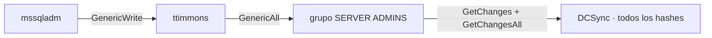

---
tags:
  - Pentesting
  - Redes-Empresariales
  - Pentesting/Movimiento-Lateral
Descripción: "La cadena de ACLs que lleva a Domain Admin: GenericWrite y Kerberoasting dirigido, GenericAll sobre un grupo con derechos de replicación y DCSync"
Fecha de actualización: 2026-07-31
Nota previa: "[[12 - Movimiento lateral II - de WinRM a mssqladm]]"
Nota siguiente: "[[14 - Después del Domain Admin - impacto y doble pivote]]"
Area: "[[Ataque a redes empresariales.base|Redes empresariales]]"
---
---

`mssqladm` no es privilegiado, pero tiene el permiso correcto sobre la cuenta correcta. Los últimos tres saltos hasta el control total del dominio son una **cadena de ACLs**: cada permiso mal delegado apunta al siguiente, hasta llegar a los derechos de replicación del directorio. <mark style="background: #ADCCFFA6;">Ninguno es una vulnerabilidad — son permisos que alguien concedió y nadie revisó</mark>.



# Salto 1 — GenericWrite → Kerberoasting dirigido

BloodHound muestra que `mssqladm` tiene **`GenericWrite`** sobre `ttimmons`. Con ese permiso hay dos caminos, y la elección importa:

| Camino | Qué hace | Rastro |
| --- | --- | --- |
| Cambiar la contraseña | Reset directo. | **Rompe** la cuenta del empleado, muy intrusivo. |
| **Kerberoasting dirigido** | Escribir un `SPN` falso en la cuenta, pedir su ticket de servicio y crackearlo offline. | No toca la contraseña. Reversible. |

<mark style="background: #FF5582A6;">Se elige el Kerberoast dirigido porque no rompe nada</mark>: `GenericWrite` permite escribir el atributo `servicePrincipalName`, y cualquier cuenta con SPN es "kerberoasteable".

```powershell-session
PS> $Cred = New-Object System.Management.Automation.PSCredential('INLANEFREIGHT\mssqladm', $SecPassword)
PS> Set-DomainObject -Credential $Cred -Identity ttimmons -SET @{serviceprincipalname='acmetesting/LEGIT'} -Verbose
```

```shell-session
$ proxychains GetUserSPNs.py -dc-ip 172.16.8.3 INLANEFREIGHT.LOCAL/mssqladm -request-user ttimmons
$krb5tgs$23$*ttimmons$INLANEFREIGHT.LOCAL$...
```

```shell-session
$ hashcat -m 13100 ttimmons_tgs /usr/share/wordlists/rockyou.txt
... Status: Cracked
```

La contraseña de `ttimmons` es débil y cae. El SPN falso se elimina después (`Set-DomainObject -Clear serviceprincipalname`) y se anota en el apéndice.

> [!info]+ Por qué el Kerberoasting sigue funcionando en 2026
> Cualquier usuario autenticado puede pedir el ticket de servicio (`TGS`) de **cualquier** cuenta con SPN, y ese ticket va cifrado con el hash de la contraseña de la cuenta — crackeable offline sin tocar el DC. Mitigaciones actuales: **gMSA/dMSA** (contraseñas gestionadas de 120+ caracteres, no crackeables), forzar `AES` sobre `RC4` (etype 23 → 17/18), y cuentas señuelo con detección. Mientras existan cuentas de servicio con contraseñas humanas, el ataque vive. La variante *dirigida* que se usa aquí es especialmente sigilosa porque no requiere que la cuenta tuviera ya un SPN. Ver [[11 - Kerberoasting]].

**Hallazgo**: ACL abusable (`GenericWrite`) + cuenta de servicio con contraseña débil (alto).

# Salto 2 — GenericAll sobre un grupo privilegiado

`ttimmons` tiene **`GenericAll`** sobre el grupo `SERVER ADMINS`. `GenericAll` es control total: incluye la capacidad de **añadir miembros**. Y `SERVER ADMINS` no es un grupo cualquiera.

```powershell-session
PS> $group = Convert-NameToSid "Server Admins"
PS> Add-DomainGroupMember -Identity $group -Members 'ttimmons' -Credential $timcreds -Verbose
[Add-DomainGroupMember] Adding member 'ttimmons' to group 'SERVER ADMINS'
```

<mark style="background: #8000E1A6;">Auto-añadirse a un grupo del que se tiene control total hereda al instante todos los derechos del grupo</mark>. Es el patrón de escalada por anidamiento de grupos: el permiso no está sobre un usuario privilegiado, está sobre un **grupo** que lo es.

> [!warning]+ Añadirse a un grupo privilegiado se anota y se revierte
> Es una modificación de pertenencia a grupo en el directorio del cliente. Se registra con hora en el *activity log*, se documenta en el apéndice, y se revierte al terminar (`Remove-DomainGroupMember`). Además, si el cliente monitoriza cambios en grupos sensibles —debería—, esto es exactamente lo que su alerta tiene que capturar; que salte es una **buena** noticia que se reconoce en el informe.

**Hallazgo**: Permisos excesivos (`GenericAll`) sobre grupo con derechos privilegiados (crítico).

# Salto 3 — DCSync

`SERVER ADMINS` tiene **`GetChanges`** y **`GetChangesAll`** sobre el dominio: los derechos de **replicación de directorio**. Son los que usa un DC para sincronizarse con otro, y quien los tiene puede pedir al DC que le replique **cualquier hash**, incluido el de `krbtgt` y el de `Administrator`. Es el ataque **DCSync**.

```shell-session
$ proxychains secretsdump.py ttimmons@172.16.8.3 -just-dc-ntlm

[*] Using the DRSUAPI method to get NTDS.DIT secrets
Administrator:500:aad3b435...:fd1f7e55xxxx...:::
krbtgt:502:aad3b435...:b9362dfa5abf924b0d172b8c49ab58ac:::
inlanefreight.local\avazquez:1716:...
<SNIP>
```

Con esto el dominio está **comprometido de forma completa y persistente**:

- El hash de `Administrator` da acceso a cualquier host por Pass-the-Hash.
- El hash de `krbtgt` permite forjar **Golden Tickets** — acceso a cualquier recurso como cualquier usuario, superviviente a cambios de contraseña. <mark style="background: #FF5582A6;">Mientras no se rote `krbtgt` dos veces, el dominio sigue comprometido aunque cambien todas las demás contraseñas</mark>.

**Hallazgo**: Compromiso total del dominio vía DCSync (crítico).

> [!info]+ DCSync es de las cosas más detectables que existen en AD
> `GetChanges`/`GetChangesAll` desde un host que **no** es un DC es una anomalía enorme: la replicación de directorio solo debería ocurrir entre controladores. **Microsoft Defender for Identity** la detecta casi en tiempo real, y una regla sobre el Event ID `4662` con el GUID de replicación la caza en cualquier SIEM. En un test evasivo, DCSync es de lo último que se hace y con máxima cautela; en este no evasivo, da igual. Ver [[15 - DCSync]] y [[24 - Auditoría avanzada en AD]].

# La lección de la cadena

Tres saltos, tres ACLs, cero exploits. El camino completo desde `hporter` (usuario raso) hasta el compromiso del dominio se apoya **entero** en configuración: credenciales en ficheros y memoria, contraseñas débiles y permisos delegados sin revisar.

Para el informe, eso se traduce en dos mensajes que valen más que la lista de hashes:

- <mark style="background: #FFB86CA6;">Romper **un** eslabón corta la cadena</mark>: si `ttimmons` no tuviera contraseña débil, o `SERVER ADMINS` no tuviera derechos de replicación, el camino se interrumpe. Eso permite al cliente priorizar por impacto, no por severidad nominal.
- Los eslabones restantes **siguen ahí**: arreglar solo el que rompía la cadena deja los otros, y otro camino puede reconstruirla. Por eso se reportan **todos** los caminos encontrados, no solo el que se recorrió — es el mensaje de causa raíz de [[10 - Prueba de concepto (PoC)]].

Alcanzar Domain Admin no es el final del trabajo, es el principio de la parte que aporta más valor: [[14 - Después del Domain Admin - impacto y doble pivote]].
