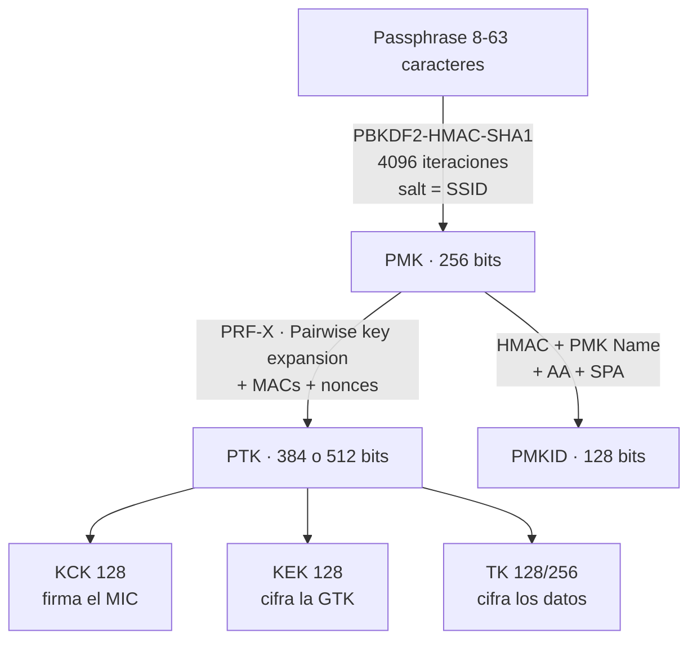

---
tags:
  - Redes
  - Protocolos
  - Wi-Fi/802.11
  - Wi-Fi/WPA
Descripción: "Cómo negocia una red WPA2 su seguridad en el RSN IE, cómo se derivan PMK y PTK, y qué expone realmente cada mensaje del 4-way handshake"
Fecha de actualización: 2026-08-04
Area: "[[Protocolos de red.base|Protocolos de red]]"
---
---

Todo lo que un atacante hace contra WPA2 —capturar un handshake, pedir un PMKID, montar un AP falso— explota una propiedad concreta de esta maquinaria. <mark style="background: #ADCCFFA6;">**RSN** (*Robust Security Network*) es el marco que 802.11i introdujo en 2004 para sustituir a [[00 - WEP, qué fue y por qué murió|WEP]]</mark>, y WPA2 es simplemente el nombre comercial que la Wi-Fi Alliance le puso a su certificación.

# WPA, WPA2, WPA3: qué nombra cada cosa

| Nombre | Qué es en realidad |
| ------ | ------------------ |
| **WPA** | Certificación de 2003 sobre un borrador de 802.11i. Cifrado `TKIP`, todavía sobre RC4 |
| **WPA2** | Certificación de 802.11i completo (2004). Cifrado `CCMP` (AES-CTR + CBC-MAC) |
| **WPA3** | Certificación de 2018. Sustituye la autenticación PSK por `SAE` — ver [[04 - WPA3, SAE y OWE]] |
| **RSN** | El mecanismo del estándar IEEE. Es lo que se ve en la trama; "WPA2" no aparece en ningún sitio |

> [!warning]+ Errata frecuente: mezclar la capa física con la de seguridad
> Circulan tablas —el módulo 312 de HTB trae una— que emparejan `802.11b` con WEP, `802.11g/n` con WPA y `802.11n/ac` con WPA2. <mark style="background: #FF5582A6;">Es una confusión de ejes</mark>: `b/g/n/ac/ax` son enmiendas de **capa física** (modulación y velocidad) y `i`/`w` son de **seguridad**. Un AP 802.11ax puede servir WEP y uno 802.11b puede servir WPA2. Lo que sí es cierto es lo inverso: 802.11n y posteriores **prohíben** usar TKIP con las tasas altas, así que ver TKIP obliga al AP a caer a 54 Mbps.

# El RSN Information Element

Cada beacon y cada *probe response* de una red RSN llevan el **elemento 48**, que declara qué cifrados y qué método de autenticación acepta el AP. Es el primer artefacto que se inspecciona en un reconocimiento, porque de él sale toda la decisión de ataque.

```text
┌────┬─────┬─────────┬──────────────┬─────────────────┬──────────────┬──────────────────┬─────────┐
│ ID │ Len │ Version │ Group Cipher │ Pairwise Cipher │ AKM Suite    │ RSN Capabilities │ PMKID   │
│ 48 │  n  │    2    │      4       │  2 + 4·n        │  2 + 4·n     │        2         │ opcional│
└────┴─────┴─────────┴──────────────┴─────────────────┴──────────────┴──────────────────┴─────────┘
```

Cada *suite* son 4 bytes: 3 de OUI (`00-0F-AC` para las del estándar) y 1 de tipo. Los tipos que importan, tomados de `wpa_common.h` de `hostap`:

| AKM | Método | Lectura ofensiva |
| --- | ------ | ---------------- |
| `00-0F-AC:1` | 802.1X (EAP) | WPA2-Enterprise. No hay PSK que crackear; el objetivo son las credenciales |
| `00-0F-AC:2` | PSK | WPA2-Personal. El handshake es crackeable offline |
| `00-0F-AC:4` | FT-PSK | Roaming rápido 802.11r. Expone el ataque al `PMK-R0` |
| `00-0F-AC:6` | PSK-SHA256 | Igual que PSK pero con MIC SHA-256. Cambia la derivación del PMKID |
| `00-0F-AC:8` | SAE | WPA3-Personal |
| `00-0F-AC:18` | OWE | *Enhanced Open*: cifrado sin contraseña |

<mark style="background: #FFB8EBA6;">Un AP que anuncia **`PSK` y `SAE` a la vez** está en modo transición WPA2/WPA3</mark>, y eso es exactamente lo que habilita el ataque de *downgrade* descrito en [[04 - WPA3, SAE y OWE]].

Los cifrados usan la misma codificación: `:2` es TKIP, `:4` CCMP-128, `:8`/`:9` GCMP-128/256, `:10` CCMP-256, y `:6`/`:11`-`:13` son los cifrados de integridad de gestión (BIP) que activa `PMF`.

De los 16 bits de **RSN Capabilities**, dos deciden si la desautenticación funciona: **`MFPC`** (bit 7, *capable*) y **`MFPR`** (bit 6, *required*). Con `MFPR=1` una deauth forjada se descarta y toda la vía clásica de captura muere.

# La jerarquía de claves



El **PMK** sale de la passphrase con `PBKDF2-HMAC-SHA1`, 4096 iteraciones y **el SSID como sal**:

```text
PMK = PBKDF2(HMAC-SHA1, passphrase, SSID, 4096, 256 bits)
```

Dos consecuencias operativas salen de ahí. La primera: <mark style="background: #8000E1A6;">la misma contraseña en dos redes con SSID distinto produce PMK distintos</mark>, y por eso una tabla precomputada sólo vale para un SSID concreto. La segunda: esas 4096 iteraciones por candidata son lo que hace que WPA2 se craquee a **unos pocos millones** de intentos por segundo en una GPU de gama alta —2,53 MH/s en una RTX 4090—, frente a los **288 GH/s** de un NTLM en esa misma tarjeta. <mark style="background: #FFB8EBA6;">Cinco órdenes de magnitud de diferencia que no dependen de la contraseña, sino de la función de derivación</mark>.

El **PTK** se deriva por sesión, y su fórmula —verificada en `wpa_common.c`— es:

```text
PTK = PRF-X(PMK, "Pairwise key expansion",
            Min(AA, SA) || Max(AA, SA) || Min(ANonce, SNonce) || Max(ANonce, SNonce))
```

El orden `Min`/`Max` es lo que permite que ambos extremos calculen lo mismo sin acordar quién va primero. `X` vale 384 bits con CCMP-128 y 512 con TKIP o los cifrados de 256 bits; el PTK se trocea en `KCK` (firma los MIC), `KEK` (cifra la GTK que viaja en M3) y `TK` (cifra los datos).

# El 4-way handshake, mensaje a mensaje

| Mensaje | Dirección | Contenido | Qué aporta al atacante |
| ------- | --------- | --------- | ---------------------- |
| **M1** | AP → cliente | `ANonce`, sin MIC | El `ANonce` y, si el AP lo incluye, el **PMKID** |
| **M2** | cliente → AP | `SNonce` + **MIC** | Cierra el material: con M1+M2 ya se puede crackear |
| **M3** | AP → cliente | GTK cifrada con KEK + MIC | Confirma que **el AP** también conoce el PMK |
| **M4** | cliente → AP | ACK + MIC | Sólo confirma la instalación de claves |

La clave está en M2. Cuando el cliente responde, ya ha calculado el PTK y firma el mensaje con el `KCK`. <mark style="background: #FFB86CA6;">Ese MIC es un oráculo offline: cualquiera que tenga M1 y M2 puede probar passphrases, derivar el PTK candidato y comparar el MIC</mark>, sin volver a tocar la red.

> [!important]+ M1+M2 prueba lo que sabe el cliente, no lo que acepta el AP
> Un par M1+M2 capturado contra un **AP falso** demuestra únicamente que el cliente cree esa contraseña. Si el usuario la tenía mal guardada, se craquea una passphrase que la red real nunca aceptaría. Sólo un par que incluya **M3** confirma que el AP legítimo comparte ese PMK. `hcxtools` distingue ambos casos y los marca como *challenge* frente a *authorized*; el detalle está en [[02 - El formato 22000 y los message pairs]].

# PMKID: handshake sin cliente

Desde 2018 no hace falta esperar a que alguien se conecte. Muchos AP incluyen el **PMKID** en el campo *Key Data* de M1, y basta con asociarse para provocarlo. Su derivación, según `rsn_pmkid()` de `hostap`:

```text
PMKID = Truncate-128(HMAC-SHA-1(PMK, "PMK Name" || AA || SPA))
```

<mark style="background: #FF5582A6;">La función hash depende del AKM negociado</mark>: SHA-1 en el caso general, **SHA-256** con `00-0F-AC:5/6/14/16` y **SHA-384** con `:13/15/17`. Un ataque que asuma SHA-1 contra una red PSK-SHA256 falla sin decir por qué.

`AA` es el BSSID y `SPA` la MAC del cliente, así que el PMKID depende del par de direcciones: no es reutilizable entre APs. Y como es un hash del PMK, se craquea con el mismo coste que el handshake.

# Lo que rompió y lo que quedó

`KRACK` (Vanhoef y Piessens, CCS 2017) demostró que reenviar M3 hace que el cliente reinstale el PTK y reinicie los contadores de nonce, permitiendo descifrar tráfico sin conocer la contraseña. Está parcheado en todo lo mantenido, pero sigue vivo en dispositivos IoT sin actualizaciones.

`TKIP` está **deautorizado** desde 802.11-2012 y fuera de la certificación Wi-Fi desde 2014. Encontrarlo hoy es un hallazgo por sí solo: obliga al AP a tasas heredadas y arrastra los ataques Beck-Tews y Ohigashi-Morii.

Lo que no ha cambiado es lo esencial: **el 4-way handshake sigue siendo un oráculo offline**, y la única defensa real contra el crackeo es una passphrase con entropía suficiente —o pasar a SAE, que elimina el oráculo por diseño.
