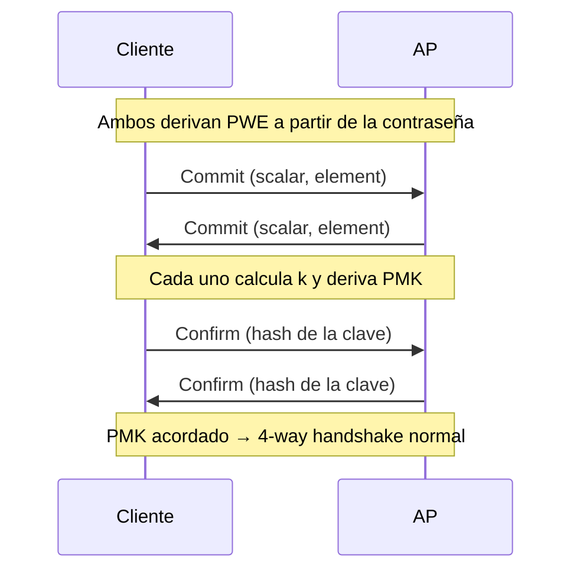

---
tags:
  - Redes
  - Protocolos
  - Wi-Fi/802.11
  - Wi-Fi/WPA3
Descripción: "Cómo SAE elimina el oráculo offline de WPA2, qué es hunting-and-pecking frente a hash-to-element, y por qué el modo transición devuelve toda la superficie de WPA2"
Fecha de actualización: 2026-08-04
Area: "[[Protocolos de red.base|Protocolos de red]]"
---
---

WPA3 no cambia el cifrado —sigue siendo `CCMP`/`GCMP`— sino **cómo se acuerda la clave**. <mark style="background: #ADCCFFA6;">Sustituye la derivación directa `passphrase → PMK` de [[03 - RSN, WPA2 y el 4-way handshake|WPA2]] por `SAE`, un intercambio de clave autenticado por contraseña (PAKE) que no deja ningún verificador crackeable en el aire</mark>. Ese es todo el cambio, y es suficiente para invalidar la técnica central del pentest Wi-Fi.

# Qué exige realmente WPA3

| Requisito | WPA2 | WPA3-Personal |
| --------- | ---- | ------------- |
| Autenticación | PSK (AKM `00-0F-AC:2`) | SAE (AKM `00-0F-AC:8`) |
| `PMF` (802.11w) | Opcional | **Obligatorio** (`MFPC=1`, `MFPR=1`) |
| Cifrado mínimo | CCMP-128 | CCMP-128 |
| Handshake tras autenticar | 4-way | 4-way (idéntico) |

El 4-way handshake **sigue ahí**: lo que cambia es de dónde sale el PMK que lo alimenta. En WPA2 el PMK es una función determinista de la contraseña y el SSID; en WPA3 es el resultado de una negociación viva entre las dos partes.

<mark style="background: #FFB86CA6;">Como `PMF` es obligatorio, la desautenticación forzada deja de funcionar</mark> — y con ella, la vía estándar para provocar un handshake.

# SAE: Dragonfly aplicado a 802.11

`SAE` (*Simultaneous Authentication of Equals*) es la instancia 802.11 de **Dragonfly**, el PAKE de [RFC 7664](https://datatracker.ietf.org/doc/html/rfc7664). Se ejecuta **dentro de las tramas Authentication** de 802.11, antes de la asociación, y consta de dos rondas simétricas:

En **Commit** cada extremo envía un escalar y un elemento de curva derivados de la contraseña y de un secreto aleatorio de sesión. En **Confirm** demuestra que llegó al mismo secreto compartido. La propiedad que importa: <mark style="background: #8000E1A6;">capturar los cuatro mensajes no permite verificar una contraseña candidata offline</mark>. Cada intento exige un intercambio nuevo con el AP, y el AP puede contarlos, ralentizarlos y bloquear.

De ahí que atacar WPA3-SAE por contraseña sea necesariamente **online**: unas pocas decenas de intentos por segundo en el mejor caso, frente a las decenas de miles por segundo y por GPU de WPA2.

> [!info]+ El AP también se protege del abuso
> Cuando el AP acumula intercambios SAE a medias, responde con un **anti-clogging token** que el cliente debe devolver en su siguiente `Commit`. Es un *cookie* de estado que impide agotar memoria con `Commit` falsificados. Dragonblood demostró que ese mecanismo era eludible (`CERT VU#871675`); las implementaciones actuales lo corrigen.

## Hunting-and-pecking frente a hash-to-element

El paso previo a Commit es derivar el **PWE** (*Password Element*), el punto de curva que representa la contraseña. Hay dos algoritmos, y la diferencia es de seguridad, no de rendimiento:

| Método | Cómo funciona | Problema |
| ------ | ------------- | -------- |
| **Hunting-and-Pecking** (HnP) | Bucle de prueba y error hasta obtener un punto válido | El **número de iteraciones depende de la contraseña** |
| **Hash-to-Element** (H2E) | Derivación directa, en tiempo constante | Ninguno conocido |

Ese bucle es el fallo. El número de vueltas se filtra por **tiempo de respuesta** y por **patrones de acceso a caché**, lo que permite reconstruir la contraseña con un diccionario offline — exactamente lo que WPA3 pretendía impedir.

> [!warning]+ El parámetro por defecto sigue siendo el vulnerable
> En `hostapd`, `sae_pwe` documenta: `0` = sólo hunting-and-pecking (**valor por defecto** sin identificador de contraseña), `1` = sólo hash-to-element, `2` = ambos. <mark style="background: #FF5582A6;">Un AP con la configuración de serie sigue expuesto al canal lateral</mark>. H2E sólo es **obligatorio** en 6 GHz (Wi-Fi 6E) y Wi-Fi 7, donde además WPA3 es obligatorio de por sí. Fuente: [`hostapd.conf`](https://w1.fi/cgit/hostap/tree/hostapd/hostapd.conf) y la [WPA3 Specification](https://www.wi-fi.org/system/files/WPA3%20Specification%20v3.3.pdf) v3.3 de la Wi-Fi Alliance.

# El modo transición: la puerta que queda abierta

Para no dejar fuera a los clientes antiguos, el AP puede anunciar **PSK y SAE simultáneamente** con la misma contraseña. Es la configuración por defecto de casi todos los despliegues reales, y **anula la ventaja de WPA3**: un atacante levanta un AP falso que sólo ofrece PSK, el cliente compatible se conecta por la vía antigua y entrega un handshake WPA2 crackeable offline.

Esto es el **downgrade de modo transición** de *Dragonblood* (Vanhoef y Ronen, [IEEE S&P 2020](https://wpa3.mathyvanhoef.com/)). No requiere posición de MITM ni romper nada: sólo ofrecer la opción peor.

La contramedida del estándar es el **Transition Disable KDE**, que el AP entrega tras autenticar para que el cliente borre la opción insegura de su perfil. `hostapd` lo documenta como un mapa de bits:

| Bit | Efecto |
| --- | ------ |
| `0x01` | WPA3-Personal: deshabilita WPA2-Personal, sólo SAE |
| `0x02` | SAE-PK: prohíbe SAE sin SAE-PK |
| `0x04` | WPA3-Enterprise: pasa a exigir PMF |
| `0x08` | Enhanced Open: prohíbe red abierta, exige OWE |

Por defecto vale `0` —**no se envía el KDE**—, así que en la práctica casi ningún despliegue lo usa. Comprobar `transition_disable` es una pregunta de auditoría concreta y accionable, y su desarrollo ofensivo está en [[05 - WPA3 en modo transición y downgrade]].

# SAE-PK: contra el gemelo malvado

En una red pública con contraseña conocida (una cafetería), cualquiera que sepa la clave puede montar un AP idéntico. **SAE-PK** ata la contraseña a una clave pública del AP: la propia passphrase es una huella de esa clave, y el AP debe firmar el intercambio.

No es infalible. Vanhoef y otros mostraron en [ACNS 2024](https://papers.mathyvanhoef.com/acns2024.pdf) que las passphrases SAE-PK cortas admiten **ataques de precomputación**: se generan pares de claves hasta encontrar uno cuya huella coincida. La longitud de la contraseña sigue mandando.

# OWE: cifrado sin contraseña

<mark style="background: #ADCCFFA6;">**OWE** (*Opportunistic Wireless Encryption*, [RFC 8110](https://datatracker.ietf.org/doc/html/rfc8110)) sustituye la red abierta por un Diffie-Hellman no autenticado</mark>: cada cliente obtiene un PMK distinto sin introducir nada. La Wi-Fi Alliance lo certifica como **Wi-Fi CERTIFIED Enhanced Open** desde 2018, con AKM `00-0F-AC:18`.

Resuelve el problema real de las redes abiertas —que cualquiera con una tarjeta en modo monitor lee el tráfico ajeno— pero **no autentica el AP**: un gemelo malvado con el mismo SSID sigue funcionando. Por eso también tiene modo transición, con el mismo riesgo de degradación.

Presentar OWE como algo "emergente" en 2026 está desfasado: lleva ocho años certificado y es obligatorio en 6 GHz para redes abiertas.

# WPA3-Enterprise y el modo de 192 bits

WPA3-Enterprise no cambia EAP: sigue siendo 802.1X sobre RADIUS. Lo que aporta es **PMF obligatorio** y un modo opcional de **192 bits** (AKM `00-0F-AC:12`) que impone `GCMP-256`, `HMAC-SHA-384` y certificados de curva P-384. Está pensado para entornos regulados y sigue siendo raro.

<mark style="background: #FFB8EBA6;">Lo que WPA3-Enterprise **no** arregla es el problema real del Wi-Fi corporativo</mark>: si el cliente no valida el certificado del servidor RADIUS, un AP falso sigue capturando credenciales. Eso se resuelve en el suplicante (`ca_cert` y `domain_suffix_match`), no en el estándar — desarrollado en [[08 - WPA2-Enterprise, evil twin y robo de credenciales]].
