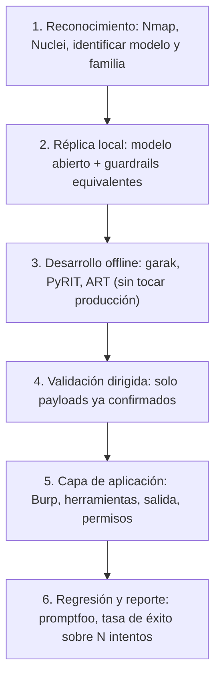

---
tags:
  - IA/Red-Team
  - IA
  - Pentesting
  - Tipo/Arsenal
Descripción: "El ecosistema se ha consolidado en cuatro proyectos"
Fecha de actualización: 2026-07-28
Nota previa: "[[12 - Detección y evasión en sistemas de IA]]"
Nota siguiente: 
Area: "[[Red Teaming AI.base|Red Teaming AI]]"
---
---

> [!info]+ Nota añadida al temario
> Eje de arsenal del vault. El módulo de HTB es conceptual y no menciona una sola herramienta. Esto es el set profesional de 2026 para automatizar y asistir el trabajo de las notas anteriores.

# Red teaming de LLM

El ecosistema se ha consolidado en cuatro proyectos. Cubren cosas distintas y en un engagement serio se usan al menos dos.

| Herramienta | Autor | Para qué |
| - | - | - |
| **[[00 - Qué es garak y cuándo usarlo\|`garak`]]** | NVIDIA | Escáner de vulnerabilidades de LLM. Amplísima biblioteca de `probes` (inyección, fuga, toxicidad, alucinación de paquetes, DAN). El equivalente a lanzar un escáner: cobertura amplia, primera pasada. **Referencia completa en [[Garak.base\|su carpeta de Tools]]** |
| **[[00 - Qué es PyRIT y cuándo usarlo\|`PyRIT`]]** | Microsoft | *Python Risk Identification Tool*. Orquestador extensible: define objetivos, conversores de payload y `scorers`, y automatiza ataques multi-turno. **Referencia completa en [[PyRIT.base\|su carpeta de Tools]]** |
| **`promptfoo`** | promptfoo | Evaluación y red teaming con enfoque de CI: define casos, genera ataques y falla el `pipeline` si una defensa se rompe. El más cómodo para regresión continua |
| **`DeepTeam`** | Confident AI | Red teaming de LLM orientado a métricas, sobre el ecosistema `DeepEval` |

**Cómo repartirlos en la práctica:** `garak` para el barrido inicial y descubrir por dónde cede el objetivo; `PyRIT` para construir el ataque dirigido a partir de esos indicios, sobre todo si necesita varios turnos; `promptfoo` para dejar las pruebas como regresión que el cliente pueda ejecutar después.

```shell-session
$ python -m garak --list_probes
$ python -m garak --target_type openai --target_name <modelo> --spec 'tag:owasp:llm01'
```

> [!warning]+ Sintaxis actualizada (v0.14, feb. 2026)
> Los flags `--model_type` / `--model_name` siguen funcionando como alias, pero los nombres primarios son ahora **`--target_type` / `--target_name`**. Y `--probes` está **deprecado** en favor de **`--spec`**, que unifica la selección de probes, buffs y tags (`tag:owasp:llm01`, `tier:2`, `-probes.dan.DanInTheWild`). Detalle en [[01 - Probes, detectors y buffs de garak]].

> [!warning]+ Dos avisos antes de lanzarlos
> **Son ruidosos por diseño.** Un barrido de `garak` son cientos o miles de prompts, la mayoría rechazados. Es exactamente la firma descrita en [[12 - Detección y evasión en sistemas de IA]]. En un engagement con requisito de sigilo, se ejecutan contra la **réplica local**, no contra producción.
>
> **`promptfoo` está en proceso de adquisición.** OpenAI la anunció el **9 de marzo de 2026** y a fecha de esta nota **no se ha cerrado**. OpenAI se comprometió a mantenerla open source bajo su licencia actual. Conviene tenerlo presente al apoyar un proceso interno del cliente sobre esa herramienta.

# ML adversarial clásico

Para lo que no es un LLM: clasificadores, detectores, modelos tabulares y de imagen.

| Herramienta | Para qué |
| - | - |
| **`Adversarial Robustness Toolbox` (ART)** | La referencia. Bajo Linux Foundation AI & Data, en desarrollo activo. Cubre **evasión, envenenamiento, extracción e inferencia**, y sirve para atacar y para defender |
| **`Foolbox`** | Ataques de evasión sobre modelos de imagen, API muy limpia. Bueno para generar ejemplos adversariales rápido |
| **`CleverHans`** | Histórica, de referencia académica. Útil para reproducir resultados de papers |
| **`TextAttack`** | Ataques adversariales sobre NLP: sustitución de palabras, paráfrasis, perturbaciones a nivel de carácter |
| **`Counterfit`** | CLI de Microsoft que envuelve ART y TextAttack. Ya no es la apuesta principal —Microsoft consolidó en `PyRIT`— pero sigue siendo cómoda para evaluar modelos alojados |

ART es la que hay que conocer bien: es la única que cubre las cuatro familias de la taxonomía NIST con una sola API, y permite implementar directamente los ataques de [[11 - Superficie de ataque por familia de modelos]].

# Seguridad de los artefactos de modelo

Directamente aplicable a lo visto en [[10 - Ataques a los componentes de sistema]]: si el formato del modelo ejecuta código al cargarse, hay que poder inspeccionarlo antes.

| Herramienta | Para qué |
| - | - |
| **[[00 - Qué es ModelScan\|`ModelScan`]]** (Protect AI) | Escanea ficheros de modelo (`pickle`, `joblib`, `h5`, SavedModel) buscando código malicioso y deserialización insegura. Mantenimiento activo |
| **[[00 - Qué es picklescan\|`picklescan`]]** | Ligera y específica: detecta `pickle` con importaciones peligrosas. Es la que usa Hugging Face en su escaneo automático |
| **[[00 - Qué es fickling y análisis de pickle\|`fickling`]]** (Trail of Bits) | **Descompila y analiza** `pickle`, e incluso permite [[01 - Uso ofensivo y defensivo de fickling\|inyectar código en él]]. La opción para entender a fondo un artefacto sospechoso, no solo marcarlo |
| **`safetensors`** | No es una herramienta de análisis sino el **formato seguro**: solo tensores, sin capacidad de ejecución. La recomendación de mitigación por defecto |

```shell-session
$ modelscan -p ./modelo_sospechoso.pkl
$ fickling --check-safety modelo.pkl
```

<mark style="background: #FF5582A6;">Regla operativa: todo artefacto de modelo de origen externo se escanea antes de cargarse, y si se puede, se convierte a `safetensors`.</mark>

# Infraestructura de MLOps

Para la superficie de [[10 - Ataques a los componentes de sistema]] no hacen falta herramientas nuevas — hacen falta las de siempre con los objetivos correctos:

```shell-session
$ nmap -sV -p 5000,8000,8001,8002,8080,8081,8265,8888,11434 <objetivo>
```

- **`Nmap`** con los puertos del stack de ML añadidos explícitamente; no están en los perfiles por defecto. Ver `02 - Recursos/🛠️ Tools/Nmap/`.
- **`Nuclei`** — hay plantillas para servicios de ML expuestos (`Ray`, `MLflow`, `TorchServe`, `Ollama`). Es la vía más rápida para confirmar exposición y ausencia de autenticación.
- **Shodan / Censys** — para el alcance externo, con búsquedas por los banners de estos servicios.
- **`Burp Suite`** — para la capa de aplicación, que sigue siendo donde está el impacto. Ver `02 - Recursos/🛠️ Tools/Burp Suite/`.

# Guardrails: conocerlos para evadirlos

Los que probablemente encuentres delante del modelo. Merece la pena montarlos en local para estudiar cómo fallan:

- **`Llama Guard`** (Meta) — clasificador de seguridad de entrada y salida. Muy extendido.
- **`NeMo Guardrails`** (NVIDIA) — marco de reglas conversacionales programables.
- **`LLM Guard`** (Protect AI) — conjunto de escáneres de entrada y salida: inyección, PII, toxicidad, secretos.
- **`Rebuff`** — detección de `prompt injection` con enfoque multicapa, incluidos tokens canario.

# Benchmarks y corpus de ataque

Para no reinventar payloads y para medir de forma comparable:

- **`JailbreakBench`** — conjunto estandarizado de `jailbreaks` y protocolo de evaluación.
- **`HarmBench`** — marco de evaluación automatizada de red teaming.
- **`AgentDojo`** — específico para agentes: evalúa `prompt injection` contra sistemas con herramientas. <mark style="background: #FFB8EBA6;">El más relevante si el objetivo es agéntico</mark>, en línea con el Top 10 agéntico de [[03 - OWASP Top 10 para aplicaciones LLM]].
- **`garak`** trae además su propio catálogo de `probes` reutilizable.

# Flujo de trabajo sugerido



<mark style="background: #8000E1A6;">El orden importa tanto como las herramientas.</mark> Empezar lanzando `garak` contra producción quema el sigilo, satura los logs del cliente y produce sobre todo rechazos. El reconocimiento de infraestructura, en cambio, es barato, silencioso y con frecuencia da el hallazgo más grave del engagement antes de haber escrito un solo prompt.

## Fuentes

- Nota net-new: no forma parte del temario de HTB Academy. Materializa el eje de arsenal del vault.
- [garak (NVIDIA)](https://github.com/NVIDIA/garak), [PyRIT (Microsoft)](https://github.com/microsoft/PyRIT), [promptfoo](https://www.promptfoo.dev/), [Adversarial Robustness Toolbox](https://github.com/Trusted-AI/adversarial-robustness-toolbox), [ModelScan](https://github.com/protectai/modelscan), [Fickling (Trail of Bits)](https://github.com/trailofbits/fickling) — estado y mantenimiento verificados 2026-07-28.
