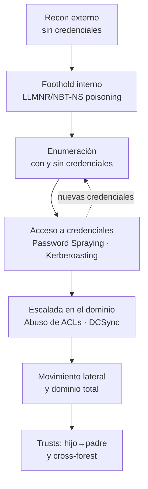

---
tags:
  - Active-Directory
  - Windows
  - Pentesting/Enumeracion
  - Introduccion
  - Tipo/Introduccion
Descripción: "Active Directory (AD) es el servicio de directorio de Microsoft para redes Windows empresariales: una base de datos jerárquica y distribuida que centraliza la identidad y el…"
Fecha de actualización: 2026-07-21
Nota previa:
Nota siguiente: "[[01 - Reconocimiento y enumeración externa]]"
Area: "[[AD Enumeración.base|Enumeración]]"
---
---

<mark style="background: #ADCCFFA6;">Active Directory (AD) es el servicio de directorio de Microsoft para redes Windows empresariales: una base de datos jerárquica y distribuida que centraliza la identidad y el control de acceso</mark> de usuarios, equipos, grupos, políticas y recursos de toda la organización. Desde Windows Server 2000 es el estándar de facto para gestionar quién es quién y quién puede hacer qué en el entorno corporativo *on-premise*.

Para un atacante esa centralización es justo el premio. <mark style="background: #FFB86CA6;">Comprometer AD equivale a controlar la organización entera</mark>: cuentas, estaciones, servidores, ficheros y la propia política de seguridad que los gobierna. Por eso el dominio —y en particular el `Domain Controller` (DC) que aloja la base de datos `NTDS.dit`— es el objetivo prioritario de casi cualquier intrusión interna. Esta área recorre el ciclo completo: del reconocimiento sin credenciales al dominio total y el salto entre dominios y bosques.

# Por qué AD es tan atacable

AD no se rompe solo por *bugs*: <mark style="background: #FFB8EBA6;">gran parte de su superficie de ataque son características de diseño funcionando como se pretende</mark>. Se construyó para la interoperabilidad y la comodidad administrativa, no para resistir a un atacante que ya está dentro de la red:

- Protocolos heredados de resolución de nombres (`LLMNR`, `NBT-NS`, `mDNS`) activos por defecto → envenenamiento y captura de hashes.
- Kerberos y sus extensiones (`SPNs`, delegación) → Kerberoasting y abuso de delegación.
- Un modelo de permisos enorme y granular (ACLs sobre objetos del directorio) → cadenas de escalada difíciles de auditar.
- Relaciones de confianza (`trusts`) entre dominios y bosques → el compromiso de un dominio "menor" se propaga hacia arriba.

<mark style="background: #8000E1A6;">La consecuencia práctica: la enumeración no es un paso inicial que se cierra, sino un bucle continuo</mark> que acompaña a cada fase. Cada credencial, grupo o ACL descubiertos reabren el mapa de ataque.

> [!info]+ AD on-prem vs. Entra ID (contexto 2026)
> Este material cubre **Active Directory on-premises** (`AD DS`). Su primo en la nube, **Microsoft Entra ID** (renombrado desde "Azure AD" en 2023), usa protocolos y ataques distintos (OAuth, tokens, *consent phishing*). En los entornos **híbridos** —los más comunes hoy— ambos coexisten y se sincronizan vía `Entra Connect`, y ese puente es una vía de escalada por derecho propio. Aquí nos centramos en el on-prem clásico.

# Piezas clave del vocabulario

Para moverse por el resto del área conviene tener claro:

- **Dominio**: unidad administrativa y de seguridad que agrupa objetos bajo un mismo espacio de nombres (p. ej. `INLANEFREIGHT.LOCAL`).
- **Bosque (`forest`)**: uno o más dominios que comparten esquema y catálogo global. <mark style="background: #FFB8EBA6;">El bosque, no el dominio, es el verdadero límite de seguridad en AD.</mark>
- **Domain Controller (DC)**: servidor que ejecuta `AD DS`, autentica peticiones y aloja `NTDS.dit`, la base de datos con **todos** los hashes del dominio.
- **Objeto y ACL**: cada usuario, equipo o grupo es un objeto con una lista de control de acceso que define quién puede leerlo o modificarlo — el terreno del abuso de ACLs.
- **Kerberos y NTLM**: los dos protocolos de autenticación de Windows; su funcionamiento a bajo nivel ya está en [[05 - Autenticación de Windows - NTLM y Kerberos]].

# El modelo de "assumed breach"

Las evaluaciones internas modernas parten de una premisa realista: <mark style="background: #ADCCFFA6;">el *assumed breach* asume que el atacante ya dispone de un punto de apoyo</mark> —una posición en la red o una cuenta de dominio de bajos privilegios— en vez de gastar toda la evaluación intentando el acceso inicial.

Tiene sentido: en un incidente real el acceso inicial acaba llegando (phishing, una VPN expuesta, un servicio vulnerable), así que el valor del ejercicio está en demostrar **hasta dónde** escala el atacante desde ese punto. <mark style="background: #FF5582A6;">Desde un único usuario de dominio sin privilegios se alcanza, con más frecuencia de la deseable, el control total del dominio (`Domain Admin`)</mark>. En la práctica alternarás dos modos: **sin credenciales** (posición de red, capturando y envenenando) y **con credenciales** (ya autenticado, enumerando y escalando).

# El ciclo de vida del ataque a AD

No es lineal: cada credencial nueva devuelve a la fase de enumeración con más visibilidad. Ese bucle es el corazón del ataque a AD.

# Cómo está organizada esta área

El módulo se divide en seis bloques que siguen ese *kill-chain*:

| Sub-tema | Qué cubre |
| --- | --- |
| [[AD Enumeración.base\|Enumeración]] | Recon externo, enumeración del dominio con y sin credenciales, controles de seguridad, *living off the land*. |
| [[AD Ataques de credenciales.base\|Ataques de credenciales]] | Envenenamiento `LLMNR`/`NBT-NS`, password spraying, Kerberoasting. |
| [[AD Abuso de ACLs.base\|Abuso de ACLs]] | Primer y enumeración de ACLs, tácticas de abuso, DCSync. |
| [[AD Escalada y movimiento.base\|Escalada y movimiento]] | Acceso privilegiado, *double hop*, vulnerabilidades *bleeding-edge*, misconfiguraciones. |
| [[AD Trusts de dominio.base\|Trusts de dominio]] | Confianzas hijo→padre y *cross-forest*. |
| [[AD Defensa y arsenal.base\|Defensa y arsenal]] | Hardening, auditoría, detección/evasión y arsenal de herramientas. |

# Atacar AD desde Linux y desde Windows

Aunque AD es tecnología Windows, <mark style="background: #FFB8EBA6;">rara vez atacarás solo desde Windows</mark>: el host de ataque suele ser Linux —con `impacket`, `NetExec`, `BloodHound`, `Responder`— y en otras ocasiones un Windows unido al dominio —con `PowerView`, `Rubeus`, `SharpHound`, `Inveigh`—. Por eso cada técnica de esta área cubre **ambos toolsets**. El inventario completo, con el estado 2026 de cada herramienta, vive en [[26 - Arsenal de herramientas AD]].

> [!warning]+ Todo esto se registra
> El AD moderno está fuertemente instrumentado: DCs con auditoría avanzada y, sobre todo, **Microsoft Defender for Identity** (MDI), que detecta Kerberoasting, DCSync, reconocimiento LDAP y movimiento lateral casi en tiempo real. Cada técnica de esta área tiene su contrapartida de telemetría; la opsec se trata en [[25 - Detección y evasión en AD]].
