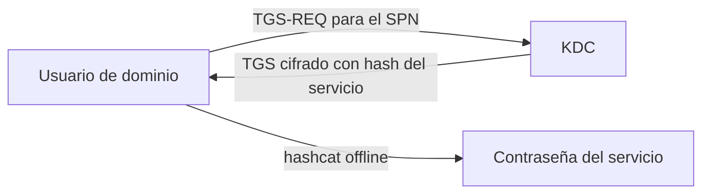

---
tags:
  - Active-Directory
  - Windows
  - Linux
  - Pentesting/Explotacion
Fecha de actualización: 2026-07-21
Nota previa: "[[10 - Password Spraying interno]]"
Nota siguiente: "[[12 - Primer de abuso de ACLs]]"
Area: "[[AD Ataques de credenciales.base|Ataques de credenciales]]"
---
---

<mark style="background: #ADCCFFA6;">El Kerberoasting es, probablemente, el ataque AD con mejor relación esfuerzo/impacto</mark>: cualquier usuario de dominio autenticado —sin privilegios especiales— puede pedir un ticket de servicio (`TGS`) para cualquier cuenta con un `SPN` (Service Principal Name). Ese ticket va cifrado con el hash de la contraseña de la cuenta de servicio, así que <mark style="background: #FFB86CA6;">lo pides, te lo llevas offline y lo crackeas para recuperar la contraseña en claro</mark>. Y las cuentas de servicio suelen tener contraseñas viejas, débiles y sin caducidad — a menudo con privilegios altos.

# El mecanismo

El usuario pide al `KDC` un `TGS` para un servicio identificado por su SPN. El KDC devuelve el ticket <mark style="background: #FFB8EBA6;">cifrado con la clave (hash NTLM/AES) de la cuenta que posee ese SPN</mark>, confiando en que solo el servicio podrá descifrarlo. El fallo: el KDC entrega el ticket a **cualquiera** que lo pida, y el cifrado se ataca offline sin límite de intentos ni bloqueo.



# Desde Linux — Impacket

```shell-session
$ impacket-GetUserSPNs -dc-ip 172.16.5.5 inlanefreight.local/forend -request
```

`-request` descarga los tickets de todas las cuentas con SPN. Se crackean con Hashcat:

```shell-session
$ hashcat -m 13100 tgs.hash rockyou.txt      # RC4
$ hashcat -m 19700 tgs.hash rockyou.txt      # AES-256
```

# Desde Windows — Rubeus

```powershell
Get-DomainUser -SPN | select samaccountname   # PowerView, enumerar primero
.\Rubeus.exe kerberoast /outfile:tgs.hash
```

`Rubeus` enumera los SPN y solicita los tickets en un solo paso.

# RC4 vs AES: el matiz que importa

<mark style="background: #FF5582A6;">Un TGS con `RC4` (tipo `0x17`, Hashcat `13100`) se crackea mucho más rápido que uno con `AES-256` (`19700`)</mark>. Antes se forzaba el *downgrade* a RC4; los dominios modernos "AES-only" solo emiten AES —más lento de crackear, pero igual de vulnerable si la contraseña es débil—. Comprueba el tipo de cifrado antes de gastar horas de GPU.

# Targeted Kerberoasting

Si tienes `GenericWrite`/`GenericAll` sobre una cuenta de usuario (ver [[14 - Tácticas de abuso de ACLs]]), puedes <mark style="background: #8000E1A6;">escribirle un SPN temporal, kerberoastearla y borrar el SPN</mark> — convirtiendo un permiso de escritura en la contraseña de esa cuenta. Una de las formas más limpias de saltar de un control ACL a credenciales.

> [!info]+ No necesitas privilegios
> El Kerberoasting solo requiere **una cuenta de dominio válida cualquiera**. Por eso es de lo primero que se prueba tras un spraying o un poisoning exitosos. Los fundamentos de Kerberos (TGT, TGS, AS-REQ) están en [[05 - Autenticación de Windows - NTLM y Kerberos]]; el abuso de tickets ya emitidos, en [[14 - Pass the Ticket (PtT)]].

> [!warning]+ Detección
> Pedir muchos TGS —y sobre todo pedirlos con **RC4** en un dominio que usa AES— es la firma clásica: evento `4769` con `Ticket Encryption Type 0x17`. `Microsoft Defender for Identity` lo detecta de serie. Pide solo los SPN que te interesen, en AES si el dominio lo usa. Más en [[25 - Detección y evasión en AD]].
