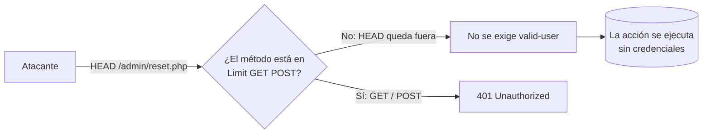

---
tags:
  - Web/Red-Team
  - Pentesting/Explotacion
  - Verb-Tampering
Fecha de actualización: 2026-07-15
Nota previa: "[[00 - Introducción a los Web Attacks]]"
Nota siguiente: "[[02 - Bypass de autenticación básica]]"
Area: "[[Web Attacks.base|Web Attacks]]"
---
---

<mark style="background: #ADCCFFA6;">Un ataque de `HTTP Verb Tampering` explota aplicaciones o servidores que no tratan de forma coherente **todos** los métodos (verbos) HTTP</mark>. El protocolo `HTTP` acepta varios verbos al inicio de cada petición, pero los desarrolladores suelen pensar solo en `GET` y `POST`. Si envías un método distinto y el back-end lo procesa de una forma no prevista, puedes <mark style="background: #FFB86CA6;">saltarte la autorización o un filtro de seguridad</mark>.

# Los verbos HTTP

`HTTP` define [9 métodos](https://developer.mozilla.org/en-US/docs/Web/HTTP/Methods). Además de `GET` y `POST`, los relevantes en ataques:

| Verbo | Descripción | Interés ofensivo |
| - | - | - |
| `HEAD` | Idéntico a `GET` pero la respuesta **solo** trae cabeceras, sin cuerpo | El servidor ejecuta la misma lógica que `GET`; sirve para disparar acciones "a ciegas" saltándose controles |
| `PUT` | Escribe el payload en la ubicación indicada | Subida/sobrescritura de ficheros en el webroot → `RCE` |
| `DELETE` | Borra el recurso | Borrado no autorizado |
| `OPTIONS` | Lista los métodos aceptados por el servidor | Enumeración de la superficie de ataque (cabecera `Allow`) |
| `PATCH` | Modificación parcial del recurso | Escritura parcial |

Algunos de estos métodos ejecutan funciones muy sensibles (escribir con `PUT`, borrar con `DELETE`). Pero lo que hace al Verb Tampering **común** —y por tanto crítico— es que no nace de un método peligroso, sino de una <mark style="background: #8000E1A6;">mala configuración en el servidor o una incoherencia en el código</mark>, cualquiera de las dos basta.

# Dos causas raíz

## 1. Configuración insegura del servidor

La autorización se limita a métodos concretos, dejando el resto accesible **sin autenticar**. Ejemplo típico en Apache:

```xml
<Limit GET POST>
    Require valid-user
</Limit>
```

Aunque exige `valid-user` para `GET` y `POST`, un atacante puede usar `HEAD` (u otro método) para <mark style="background: #FF5582A6;">saltarse la autenticación por completo</mark> y acceder a páginas restringidas.



## 2. Código inseguro

El desarrollador aplica un filtro a **una** fuente de parámetros pero la acción real usa **otra**. Ejemplo: mitigar una `SQL Injection` validando solo `$_GET`, pero ejecutar la consulta con `$_REQUEST` (que incluye `GET` **y** `POST`):

```php
$pattern = "/^[A-Za-z\s]+$/";
if (preg_match($pattern, $_GET["code"])) {
    $query = "Select * from ports where port_code like '%" . $_REQUEST["code"] . "%'";
    // ...
}
```

El filtro solo mira `$_GET["code"]`. Si mandas la inyección por `POST`, `$_GET["code"]` va **vacío** (pasa el filtro) pero `$_REQUEST["code"]` sí contiene el payload → la [[00 - Introducción a SQL Injection|SQLi]] se ejecuta igual. <mark style="background: #FFB8EBA6;">Esta segunda variante es mucho más frecuente</mark>, porque es un error de programación y no está bien documentado como los `.htaccess`.

> [!important]+ La clave conceptual
> El bug no es "aceptar `HEAD`" ni "usar `$_REQUEST`" por separado. Es la **discrepancia** entre el método/parámetro que se **valida** y el que se **honra**. Siempre que control (auth o filtro) y acción miran fuentes distintas, hay verb tampering.

# Relevancia actual (más allá de HTB)

En frameworks modernos con **routing explícito por método** (`app.get()` vs `app.post()` en Express, decoradores en FastAPI/Spring), el verb tampering clásico es raro: un método no mapeado devuelve `404`/`405` limpio. Dónde sigue vivo:

- <mark style="background: #FFB86CA6;">**Cabeceras de *method override***</mark>: muchos frameworks respetan `X-HTTP-Method-Override`, `X-HTTP-Method` o `X-Method-Override` para tunelizar el método real dentro de un `POST`. Un WAF o un proxy que decide en base al verbo visible (`POST`) puede dejar pasar un `PUT`/`DELETE` real.
- **Spoofing con `_method`**: Rails, Laravel y Symfony convierten un `POST` con campo `_method=DELETE` en un `DELETE`. Útil para invocar handlers restringidos que el WAF no espera.
- **Verbos arbitrarios**: Apache `httpd` trata métodos desconocidos (`FOO`, `CAT`) como `GET` en muchas configuraciones, lo que evade reglas `<Limit>` que solo listan verbos estándar.
- **APIs**: el control de acceso por método mal implementado es exactamente `BFLA` ([[05 - Broken Function Level Authorization (API5)|API5:2023]]) en el mundo de las APIs.

Los dos vectores que veremos a continuación son los ejemplos canónicos: [[02 - Bypass de autenticación básica|saltar HTTP Basic Auth]] (configuración insegura) y [[03 - Bypass de filtros de seguridad|saltar un filtro de inyección]] (código inseguro).

## Referencias

- MDN — [HTTP request methods](https://developer.mozilla.org/en-US/docs/Web/HTTP/Methods)
- OWASP WSTG — [Testing for HTTP Verb Tampering](https://owasp.org/www-project-web-security-testing-guide/v41/4-Web_Application_Security_Testing/07-Input_Validation_Testing/03-Testing_for_HTTP_Verb_Tampering)
- The Hacker Recipes — [HTTP methods](https://www.thehacker.recipes/web/config/http-methods)
- HackTricks — [403 & 401 Bypasses](https://book.hacktricks.xyz/network-services-pentesting/pentesting-web/403-and-401-bypasses)
- HTB Academy — *Web Attacks* (base, 2021)
