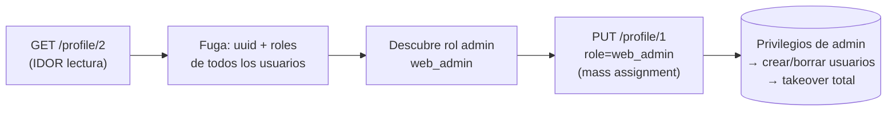

---
tags:
  - Web/Red-Team
  - Pentesting/Explotacion
  - IDOR
Fecha de actualización: 2026-07-15
Nota previa: "[[10 - IDOR en APIs inseguras]]"
Nota siguiente: "[[12 - Detección, evasión y prevención de IDOR]]"
Area: "[[Web Attacks.base|Web Attacks]]"
---
---

Los ataques directos de la sección anterior fallaron porque nos faltaban datos (el `uuid` de la víctima, un nombre de rol válido). La solución: <mark style="background: #FFB86CA6;">encadenar un IDOR de *Information Disclosure* con uno de *Insecure Function Call*</mark>. Leer para obtener lo que falta, escribir con ello.

# Paso 1: Information Disclosure vía GET

La única "autorización" en la petición era la cookie `role=employee`; no hay token ligado al objeto. Lanzamos un `GET` con otro `uid`:

```json
{
  "uid": "2",
  "uuid": "4a9bd19b3b8676199592a346051f950c",
  "role": "employee",
  "full_name": "Iona Franklyn",
  "email": "i_franklyn@employees.htb",
  "about": "It takes 20 years to build a reputation..."
}
```

Devuelve los detalles de otro usuario → <mark style="background: #FF5582A6;">IDOR de Information Disclosure confirmado</mark>. Y nos da justo lo que no podíamos calcular: el `uuid` del usuario 2.

# Paso 2: modificar a otro usuario

Con su `uuid` en la mano, el `PUT` a `/profile/api.php/profile/2` ya **no** da error de control de acceso — actualizamos sus datos. Esto abre dos ataques potentes:

- <mark style="background: #8000E1A6;">**Account takeover por reset**</mark>: cambiar el `email` de la víctima a uno nuestro y pedir un password reset → el enlace llega a nuestro buzón.
- **XSS almacenado**: meter un payload en el campo `about`, que se ejecuta cuando la víctima abre su *Edit profile* → [[01 - XSS Almacenado|XSS almacenado]] dirigido.

# Paso 3: enumerar roles y escalar

Como tenemos IDOR de lectura, **enumeramos todos los usuarios** buscando otros roles. Aparece un admin:

```json
{
  "uid": "X",
  "uuid": "a36fa9e66e85f2dd6f5e13cad45248ae",
  "role": "web_admin",
  "full_name": "administrator",
  "email": "webadmin@employees.htb",
  "about": "HTB{FLAG}"
}
```

Ahora conocemos un **nombre de rol válido**: `web_admin`. En el paso anterior, cambiar `role` daba `Invalid role` porque no sabíamos ninguno. Ahora ponemos `"role": "web_admin"` en **nuestro** perfil vía `PUT`:

```json
{
  "uid": "1",
  "uuid": "40f5888b67c748df7efba008e7c2f9d2",
  "role": "web_admin",
  ...
}
```

No hay error: <mark style="background: #FFB86CA6;">el back-end no valida que el usuario tenga derecho a asignarse ese rol</mark>. Refrescamos (o ponemos `Cookie: role=web_admin` a mano) y ahora **sí** podemos crear y borrar usuarios. La cadena completa:



# Por qué esto importa (impacto y reporte)

Combinando información filtrada con llamadas de función inseguras, saltamos **varios** controles de acceso a la vez. Este patrón —<mark style="background: #ADCCFFA6;">*leak → mass assignment → privesc → ATO*</mark>— es uno de los más rentables en bug bounty:

- Con el rol admin podemos hacer **mass assignment** sobre todos los usuarios: inyectar XSS en todos los perfiles, o cambiar todos los emails a uno nuestro (para resets masivos).
- Al reportar, la fuerza está en la **cadena**, no en el IDOR aislado. Documenta: (1) el `GET` que filtra, (2) el dato crítico obtenido (`uuid`, rol), (3) el `PUT` que escala, (4) el impacto final (control total). Un IDOR de lectura "menor" se convierte en `Critical` al demostrar el takeover.

> [!tip]+ Buscar la cadena, no el bug suelto
> La lección transversal: la información que filtras con un IDOR casi siempre alimenta **otro** ataque (otro IDOR, XSS, password reset, [[00 - Introducción a Command Injection|inyección]]). No te detengas en "leo datos ajenos"; pregunta "¿qué desbloquea este dato?". La mayoría de hallazgos `High`/`Critical` en programas maduros son cadenas, no vulnerabilidades individuales.

Cerramos IDOR con la [[12 - Detección, evasión y prevención de IDOR|detección, evasión y prevención]] y las [[13 - Herramientas para IDOR|herramientas]] profesionales.

## Referencias

- PortSwigger — [Exploiting IDOR / access control chains](https://portswigger.net/web-security/access-control)
- OWASP API Security — [API5:2023 Broken Function Level Authorization](https://owasp.org/API-Security/editions/2023/en/0xa5-broken-function-level-authorization/)
- HTB Academy — *Web Attacks* (base, 2021)
