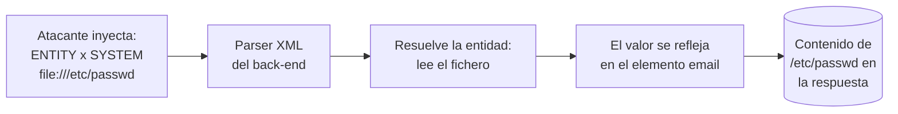

---
tags:
  - Web/Red-Team
  - Pentesting/Explotacion
  - XXE
Fecha de actualización: 2026-07-15
Nota previa: "[[14 - Introducción a XXE]]"
Nota siguiente: "[[16 - XXE a RCE, SSRF y DoS]]"
Area: "[[Web Attacks.base|Web Attacks]]"
---
---

El ataque XXE base: definir una entidad externa que apunte a un fichero local y lograr que su contenido se **refleje** en la respuesta. Es la explotación más directa y la que más rendimiento da en un pentest (leer configs, claves, código fuente).

# Identificar

El primer paso es encontrar un endpoint que acepte **entrada XML**. En el lab, un *Contact Form*; interceptando el envío en [[01 - Instalación y configuración del proxy|Burp]] vemos que manda los datos en formato XML → objetivo potencial de XXE.

Observa **qué elemento se refleja** en la respuesta: si al enviar el formulario la página muestra el valor del elemento `<email>`, ese es nuestro punto de inyección. Confirmamos la vulnerabilidad definiendo una entidad interna y comprobando si el parser la sustituye:

```xml
<!DOCTYPE email [
  <!ENTITY company "Inlane Freight">
]>
```

Y usamos `&company;` en lugar de nuestro email. <mark style="background: #FF5582A6;">Si la respuesta muestra "Inlane Freight" (y no el literal `&company;`), el parser procesa nuestras entidades → es vulnerable a XXE</mark>. Una app no vulnerable mostraría `&company;` en crudo.

> [!tip]+ Si la petición no era XML
> Muchas apps usan `JSON` por defecto pero **aceptan** XML igualmente. Cambia `Content-Type: application/json` → `application/xml`, convierte el body a XML (con cualquier conversor) y prueba. Esto destapa XXE inesperados. Si ya había un `DOCTYPE` en la petición, solo añade el `ENTITY`; si no, añade el `DTD` entero.

# Leer ficheros sensibles

Confirmada la inyección, cambiamos la entidad interna por una **externa** con `SYSTEM` apuntando al fichero:

```xml
<!DOCTYPE email [
  <!ENTITY company SYSTEM "file:///etc/passwd">
]>
```

Al reflejar `&company;`, obtenemos el contenido de `/etc/passwd`.



Esto permite leer configs con contraseñas, claves `id_rsa` de SSH, etc. Las mismas técnicas de post-explotación de [[01 - Local File Inclusion (LFI)|LFI / Directory Traversal]] aplican aquí una vez tenemos lectura arbitraria.

> [!tip]+ Listado de directorios en Java
> En apps Java, referenciar un **directorio** en vez de un fichero (`file:///var/www/html/`) devuelve a menudo un **listado** de su contenido, muy útil para localizar ficheros sensibles a ciegas.

# Leer el código fuente (`php://filter`)

Leer código fuente convierte una caja negra en un [[Whitebox]] parcial (secretos, claves de API, más vulnerabilidades). Pero un intento directo sobre `index.php` **falla**: si el fichero contiene caracteres especiales de XML (`<`, `>`, `&`) o datos binarios, <mark style="background: #FFB8EBA6;">rompe el formato y la entidad no se resuelve</mark>.

La solución en PHP: el wrapper `php://filter` con el encoder `convert.base64-encode`. El `base64` resultante no contiene caracteres que rompan el XML:

```xml
<!DOCTYPE email [
  <!ENTITY company SYSTEM "php://filter/convert.base64-encode/resource=index.php">
]>
```

La respuesta trae el `base64` de `index.php`, que decodificamos (el *Inspector* de Burp lo hace en el panel derecho). <mark style="background: #8000E1A6;">Esto solo funciona en apps PHP</mark>; para cualquier otro framework usaremos el truco `CDATA` de [[17 - Divulgación avanzada de archivos|divulgación avanzada]].

> [!info]+ Otros esquemas útiles
> Además de `file://` y `php://filter`, según el parser: `http://`/`https://` (para [[16 - XXE a RCE, SSRF y DoS|SSRF]]), `ftp://`, y en Java `jar://`, `netdoc://`. Estos esquemas amplían mucho lo que un XXE puede alcanzar más allá de leer un fichero plano.

Cuando el fichero rompe el formato incluso con estos trucos, o cuando la app no refleja nada, escalamos a técnicas avanzadas ([[17 - Divulgación avanzada de archivos|CDATA y error-based]]) o a exfiltración [[18 - Exfiltración de datos ciega (OOB)|ciega OOB]]. Primero, veamos hasta dónde llega el impacto: [[16 - XXE a RCE, SSRF y DoS|RCE, SSRF y DoS]].

## Referencias

- PortSwigger — [Exploiting XXE to retrieve files](https://portswigger.net/web-security/xxe#exploiting-xxe-to-retrieve-files)
- HackTricks — [XXE - XML External Entity](https://book.hacktricks.xyz/pentesting-web/xxe-xee-xml-external-entity)
- PayloadsAllTheThings — [XXE Injection](https://github.com/swisskyrepo/PayloadsAllTheThings/tree/master/XXE%20Injection)
- HTB Academy — *Web Attacks* (base, 2021)
