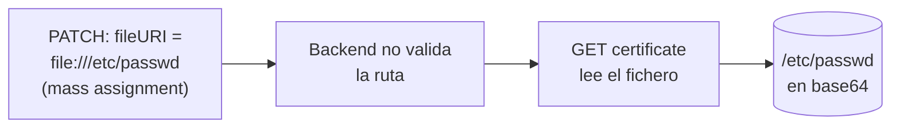

---
tags:
  - Web/Red-Team
  - Pentesting/Explotacion
  - API
  - Server-Side/SSRF
Fecha de actualización: 2026-07-15
Nota previa: "[[06 - Unrestricted Access to Sensitive Business Flows (API6)]]"
Nota siguiente: "[[08 - Security Misconfiguration (API8)]]"
Area: "[[API Attacks.base|API Attacks]]"
---
---

Una API es vulnerable a [[00 - Introducción a los ataques server-side|`SSRF`]] (Server-Side Request Forgery, también *XSPA*) si <mark style="background: #ADCCFFA6;">usa entrada controlada por el usuario para pedir recursos remotos o locales sin validarla</mark>. El atacante fuerza al servidor a lanzar peticiones a destinos inesperados —típicamente internos— saltándose firewalls y VPNs. En el lab: `CWE-918`, y con un giro interesante: el SSRF se habilita **encadenando un mass assignment**.

# Escenario: mass assignment → SSRF por `file://`

Como supplier (`SupplierCompanies_Update` + `SupplierCompanies_UploadCertificateOfIncorporation`), subimos un certificado con `POST /api/v1/supplier-companies/certificates-of-incorporation`. La respuesta trae un `fileURI`, y la API almacena la ruta usando el **esquema `file://`**. Al consultar `/api/v1/supplier-companies/current-user`, el campo `certificateOfIncorporationPDFFileURI` apunta al fichero subido.

El detalle explotable: el `PATCH /api/v1/supplier-companies` permite **modificar** `CertificateOfIncorporationPDFFileURI` — un campo que <mark style="background: #FFB8EBA6;">solo debería fijar el endpoint de subida</mark> ([[03 - Broken Object Property Level Authorization (API3)|mass assignment / CWE-915]]). Lo apuntamos a un fichero del sistema:

```http
PATCH /api/v1/supplier-companies HTTP/1.1
Authorization: Bearer <JWT>
Content-Type: application/json

{ "CertificateOfIncorporationPDFFileURI": "file:///etc/passwd" }
```

Como el backend **no valida** la ruta, al pedir el certificado con `GET /api/v1/supplier-companies/{ID}/certificates-of-incorporation` nos devuelve el contenido de `/etc/passwd` en `base64`:

```shell-session
$ echo "cm9vdDp4OjA6MDpyb290Oi9yb290Oi9iaW4vYmFzaAo..." | base64 -d
root:x:0:0:root:/root:/bin/bash
...
```

<mark style="background: #FF5582A6;">Lectura arbitraria de ficheros locales</mark> (`/etc/passwd`, `/etc/shadow`, config con secretos) vía el esquema `file://`. La cadena completa: **mass assignment → SSRF → local file read**.



# SSRF en APIs: el cuadro completo

El lab usa `file://`, pero el SSRF clásico en APIs usa `http://` hacia destinos internos. Todo el arsenal del módulo [[00 - Introducción a los ataques server-side|Server-Side Attacks]] aplica:

- <mark style="background: #FFB86CA6;">**Metadatos cloud**</mark>: `http://169.254.169.254/latest/meta-data/` (AWS), `metadata.google.internal` (GCP), IMDSv1 sin token → robo de credenciales de rol.
- **Red interna**: escaneo de puertos, acceso a paneles/DBs internas, `http://localhost:8080/admin`.
- **Esquemas alternativos**: `file://`, `gopher://` (peticiones arbitrarias, incluso a Redis/SMTP), `dict://`.
- **Bypass de filtros**: IPs alternativas (decimal, octal, IPv6), redirects, DNS rebinding ([[00 - Introducción a Modern Web Exploitation Techniques|Modern Web Exploitation]]). Ver [[05 - Evasión de defensas SSRF|evasión SSRF]].

> [!tip]+ Dónde buscar SSRF en una API
> Cualquier parámetro que sea una **URL, una ruta o un `fileURI`**: webhooks, "importar desde URL", generación de PDF/thumbnails, avatares por URL, callbacks, integraciones. Y como aquí, campos que almacenan rutas y que un mass assignment permite reescribir.

# Prevención

- **Validar** que las URIs/rutas apuntan **solo** a recursos permitidos (aquí, dentro de `wwwroot/SupplierCompaniesCertificatesOfIncorporations/`). Allowlist, nunca blocklist.
- El endpoint que sirve ficheros debe restringirse a la carpeta designada, como **segunda capa** por si falla la validación de entrada.
- Para SSRF `http://`: allowlist de dominios, bloquear rangos internos/metadatos, forzar `IMDSv2`, resolver y validar la IP final (anti-rebinding).

Siguiente: [[08 - Security Misconfiguration (API8)|Security Misconfiguration]] (incluida SQLi).

## Referencias

- OWASP — [API7:2023 Server Side Request Forgery](https://owasp.org/API-Security/editions/2023/en/0xa7-server-side-request-forgery/)
- MITRE — [CWE-918](https://cwe.mitre.org/data/definitions/918.html)
- PortSwigger — [SSRF](https://portswigger.net/web-security/ssrf)
- HTB Academy — *API Attacks* (base, 2024)
