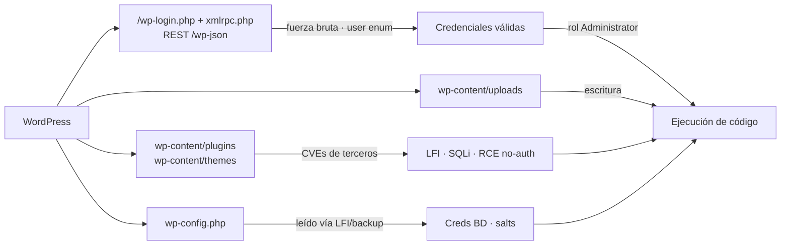

---
tags:
  - Web/Red-Team
  - WordPress
  - Introduccion
Fecha de actualización: 2026-07-17
Nota previa: "[[01 - Descubrimiento y enumeración de aplicaciones]]"
Nota siguiente: "[[01 - Enumeración de WordPress]]"
Area: "[[Common Applications.base|Common Applications]]"
---
---

<mark style="background: #ADCCFFA6;">WordPress es el CMS más usado de la web</mark> — mueve en torno al 43% de todos los sitios de internet (W3Techs, 2025) y más del 60% del mercado de CMS. Corre en PHP sobre un stack LAMP (Linux + Apache + MySQL + PHP), y su fuerza es también su talón de Aquiles: se extiende con **temas** y **plugins** de terceros. Ese ecosistema es donde vive el grueso de las vulnerabilidades. Según el desglose histórico de [WPScan](https://wpscan.com/), de las miles de vulnerabilidades catalogadas <mark style="background: #FFB86CA6;">el ~54% están en plugins, el ~31,5% en el core y el ~14,5% en temas</mark>. Lo usan desde The New York Times hasta Sony: el impacto de un fallo se multiplica por la cuota de mercado.

Entender la **estructura de ficheros** y el **modelo de roles** antes de atacar no es trámite: define qué rutas peinar durante la enumeración y qué nivel de acceso necesitas para escalar a ejecución de código.

# Estructura de ficheros por defecto

En una instalación Linux estándar todo cuelga del webroot `/var/www/html`:

```shell-session
$ tree -L 1 /var/www/html
.
├── index.php
├── license.txt
├── readme.html
├── wp-activate.php
├── wp-admin
├── wp-blog-header.php
├── wp-config.php
├── wp-config-sample.php
├── wp-content
├── wp-cron.php
├── wp-includes
├── wp-login.php
├── wp-mail.php
├── wp-settings.php
├── wp-signup.php
└── xmlrpc.php
```

Ficheros y directorios que importan en un pentest:

- **`license.txt` / `readme.html`** — <mark style="background: #FF5582A6;">filtran la versión del core</mark> en instalaciones antiguas. Primer sitio donde mirar.
- **`wp-admin/`** — backend y panel de administración. La página de login vive en `/wp-login.php` (y `/wp-admin` redirige allí). Puede renombrarse para ocultarla.
- **`xmlrpc.php`** — API antigua que transmite datos con XML sobre HTTP. Superada en la práctica por la **REST API** (`/wp-json`) — aunque nunca se deprecó oficialmente —, pero <mark style="background: #FFB8EBA6;">sigue habilitada por defecto en muchísimos sitios</mark> y es un vector de ataque en sí (fuerza bruta amplificada, pingback SSRF, DoS). Ver [[02 - Login y fuerza bruta en WordPress]].
- **`wp-content/`** — el directorio caliente: aquí viven `plugins/`, `themes/` y `uploads/`.
- **`wp-includes/`** — ficheros del core (certificados, fuentes, librerías JS, widgets). Poco interesante salvo para fingerprinting de versión.

## `wp-config.php` — el objetivo dorado

Contiene todo lo que WordPress necesita para arrancar: credenciales de la base de datos, las claves y *salts* de autenticación, el prefijo de tablas y flags de depuración.

```php
<?php
/** The name of the database for WordPress */
define( 'DB_NAME', 'database_name_here' );
define( 'DB_USER', 'username_here' );
define( 'DB_PASSWORD', 'password_here' );
define( 'DB_HOST', 'localhost' );

/** Authentication Unique Keys and Salts */
define( 'AUTH_KEY',        'put your unique phrase here' );
define( 'SECURE_AUTH_KEY', 'put your unique phrase here' );
define( 'LOGGED_IN_KEY',   'put your unique phrase here' );
define( 'NONCE_KEY',       'put your unique phrase here' );
/* <SNIP> */

$table_prefix = 'wp_';
define( 'WP_DEBUG', false );
```

> [!important]+ Por qué `wp-config.php` es el santo grial
> Cualquier primitiva de lectura de ficheros — un **LFI**, un *directory traversal*, un *backup* olvidado (`wp-config.php.bak`, `wp-config.php~`) — que alcance este fichero entrega <mark style="background: #FF5582A6;">las credenciales de la base de datos en texto plano</mark>. Si MySQL es accesible desde fuera, eso es <mark style="background: #8000E1A6;">compromiso total sin tocar el login</mark>. Y las *salts* (`AUTH_KEY`, etc.) permiten **forjar cookies de sesión** válidas. Es el primer fichero que persigue cualquier LFI en un WordPress.

## `wp-content/` — la superficie de ataque

```shell-session
$ tree -L 1 /var/www/html/wp-content
.
├── index.php
├── plugins
└── themes
```

`plugins/` y `themes/` guardan el código de terceros donde vive la mayoría de CVEs. `uploads/` (subdirectorio habitual) es donde aterrizan los ficheros subidos por la plataforma — destino natural de una *web shell*. Estos directorios se enumeran a fondo: incluso plugins **desactivados** siguen siendo accesibles y explotables ([[01 - Enumeración de WordPress|directory indexing]]).

# Modelo de roles

Una instalación estándar define cinco roles con privilegios crecientes:

| Rol | Capacidades |
| - | - |
| **Administrator** | Control total del sitio, gestión de usuarios y, crucialmente, **edición de código fuente** (temas/plugins) |
| Editor | Publica y gestiona posts de todos los usuarios |
| Author | Publica y gestiona sus propios posts |
| Contributor | Escribe sus posts pero **no puede publicarlos** |
| Subscriber | Solo navega y edita su perfil |

<mark style="background: #FFB86CA6;">Acceso como Administrator ≈ ejecución de código en el servidor</mark>: el panel permite editar el PHP de temas y plugins (ver [[04 - RCE como administrador en WordPress]]). Pero no hay que fijarse solo en el admin — <mark style="background: #FFB8EBA6;">un Editor o Author puede alcanzar plugins vulnerables</mark> a los que un Subscriber no llega, y esos plugins pueden ser el pivote hacia RCE.

# Mapa de la superficie de ataque



> [!info]+ Modernización: qué ha cambiado desde el core clásico
> `xmlrpc.php` está en retirada a favor de la **REST API** (`/wp-json/wp/v2/…`), que hoy es el canal principal de enumeración de usuarios cuando `?author=` y xmlrpc están bloqueados. Desde **WordPress 5.6** (2020) existen las **Application Passwords**: credenciales de aplicación por usuario usables vía HTTP Basic Auth contra la REST API — un vector de autenticación nuevo y forzable por fuerza bruta que el material clásico no cubre. Ambos se tratan en [[01 - Enumeración de WordPress]] y [[02 - Login y fuerza bruta en WordPress]].

Con el modelo mental de estructura y roles claro, el siguiente paso es identificar la instalación y sacar versión, plugins, temas y usuarios: [[01 - Enumeración de WordPress]].
