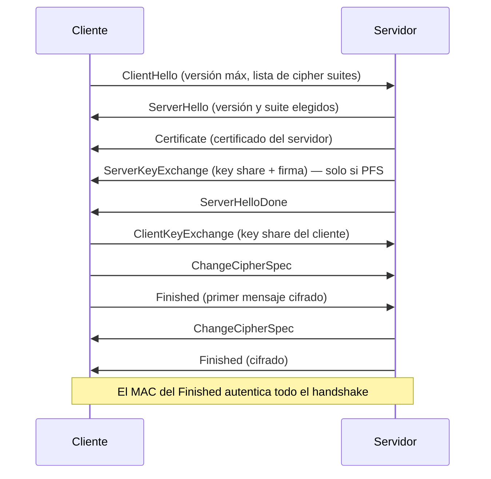
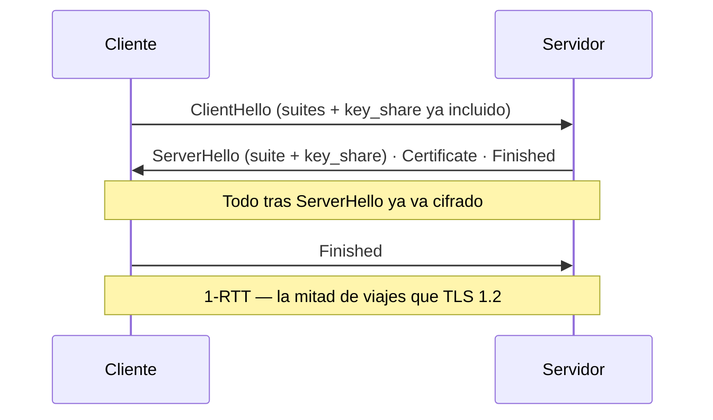

---
tags:
  - Web/Red-Team
  - Pentesting/Enumeracion
  - TLS
Descripción: "El handshake es el proceso donde cliente y servidor negocian todos los parámetros de la sesión TLS y derivan la clave simétrica compartida"
Fecha de actualización: 2026-07-14
Nota previa: "[[01 - Infraestructura de Clave Pública (PKI)]]"
Nota siguiente: "[[03 - Padding Oracle Attacks]]"
Area: "[[HTTPs-TLS.base|HTTPs/TLS]]"
---
---

El **handshake** es el proceso donde cliente y servidor negocian todos los parámetros de la sesión TLS y derivan la clave simétrica compartida. <mark style="background: #ADCCFFA6;">Sigue un esquema predefinido y es, literalmente, donde se decide la seguridad de la conexión</mark>: la versión de TLS y el *cipher suite* que aquí se acuerdan determinan qué ataques del resto del módulo son posibles. Por eso esta nota es el punto de pivote entre la teoría y los ataques.

# Cipher suites: qué se negocia

Un **cipher suite** define los algoritmos de la conexión: intercambio de claves, autenticación, cifrado (algoritmo + modo) e integridad (`MAC`). En TLS 1.2 el nombre lo dice todo:

```text
TLS_DHE_RSA_WITH_AES_128_CBC_SHA256
    │    │       │       │    │
    │    │       │       │    └─ MAC: HMAC-SHA256 (integridad)
    │    │       │       └────── Modo: CBC
    │    │       └────────────── Cifrado: AES-128 (confidencialidad, simétrico)
    │    └────────────────────── Autenticación del servidor: RSA
    └─────────────────────────── Intercambio de claves: Diffie-Hellman efímero
```

El cifrado es **simétrico** por rendimiento; la clave simétrica se intercambia con un algoritmo **asimétrico** (el *key exchange*). <mark style="background: #FFB8EBA6;">Los suites `DHE` y `ECDHE` aportan **Perfect Forward Secrecy (PFS)**</mark>: usan claves efímeras, así que comprometer la clave privada del servidor **no** permite descifrar sesiones pasadas capturadas. Los suites `RSA` estáticos (sin efímero) **no** tienen PFS — y además abren la puerta a [[05 - Bleichenbacher y DROWN|Bleichenbacher]].

# Handshake TLS 1.2



El servidor elige una versión **igual o inferior** a la ofrecida por el cliente y un suite de la lista del `ClientHello`. Ese "igual o inferior" es la raíz de los [[10 - Downgrade Attacks|ataques de downgrade]]: si un `man-in-the-middle` manipula el `ClientHello` para ofrecer solo versiones/suites débiles, el servidor los aceptará.

# Handshake TLS 1.3: más corto y más seguro



TLS 1.3 <mark style="background: #8000E1A6;">elimina el `ClientKeyExchange` metiendo el `key_share` del cliente ya en el `ClientHello`</mark>, y cifra todo lo que sigue al `ServerHello` (incluido el certificado). El cliente envía varios `key_share` para grupos distintos, apostando a acertar el que elegirá el servidor. Sus cipher suites son mucho más cortos porque **solo** especifican cifrado+modo y hash:

```text
TLS_AES_128_GCM_SHA256
```

La autenticación y el key exchange se negocian por separado, y <mark style="background: #FFB8EBA6;">solo se admiten intercambios con PFS y cifradores `AEAD`</mark>. Esto es lo que mata de raíz padding oracles, compresión TLS y RSA estático: un servidor *TLS 1.3-only* es inmune a casi todo este módulo.

# Por qué el handshake ES la superficie de ataque

Cada decisión del suite habilita un vector concreto. Esta tabla es el mapa del resto del sub-tema:

| Elección en el handshake | Ataque que habilita |
| - | - |
| Versión SSL 3.0 / TLS 1.0 | [[04 - POODLE y BEAST\|POODLE, BEAST]] |
| Modo `CBC` | [[03 - Padding Oracle Attacks\|Padding oracle]], `Lucky13` |
| Key exchange `RSA` estático (sin PFS) | [[05 - Bleichenbacher y DROWN\|Bleichenbacher, ROBOT, DROWN]] |
| Compresión TLS negociada | [[06 - Ataques de compresión (CRIME y BREACH)\|CRIME]] |
| Cifradores `export`/débiles | [[10 - Downgrade Attacks\|FREAK, Logjam]] |
| Aceptar versión inferior a la pedida | [[10 - Downgrade Attacks\|Downgrade]] genérico |

# Inspeccionar un handshake

`Wireshark` es la herramienta de referencia para diseccionar un handshake capturado (filtro `tls`): permite ver el `ClientHello` (versiones y suites ofrecidos), el `ServerHello` (lo elegido) y los `key_share`. En un TLS 1.3 se aprecia la ausencia de `Certificate` y `ClientKeyExchange` en claro.

```shell-session
# Ver el handshake real contra un servidor, con detalle
$ openssl s_client -connect target.htb:443 -tls1_2 -cipher 'ECDHE-RSA-AES128-GCM-SHA256'
# Forzar una versión concreta para probar qué acepta
$ openssl s_client -connect target.htb:443 -tls1   # ¿sigue aceptando TLS 1.0?
```

> [!warning] Gotchas modernos que HTB no cubre
> - **0-RTT (early data)** en TLS 1.3: permite reanudar sesión enviando datos en el primer viaje, pero <mark style="background: #FF5582A6;">esos datos son **replayables** por un atacante</mark>. Nunca deben transportar operaciones no idempotentes (un `POST` de transferencia). Es un hallazgo real a revisar.
> - **SNI en claro**: el `ClientHello` revela el dominio destino (`server_name`) sin cifrar. **Encrypted Client Hello (ECH)** lo está resolviendo (2024+), pero su despliegue es parcial.
> - **Cripto post-cuántica**: desde 2024 se despliega el key exchange híbrido `X25519MLKEM768` en TLS 1.3. Verlo en un `ClientHello` moderno ya es normal; su ausencia no es hallazgo, pero conviene reconocerlo.
> - **Downgrade sentinel**: TLS 1.3 inserta un valor centinela en `ServerHello.random` para que un downgrade forzado a 1.2 se detecte. Refuerza [[10 - Downgrade Attacks]].

## Referencias

- [RFC 8446 — TLS 1.3](https://www.rfc-editor.org/rfc/rfc8446)
- [The Illustrated TLS 1.3 Connection](https://tls13.xargs.org/) — handshake byte a byte
- [Cloudflare — TLS 1.3 & 0-RTT](https://blog.cloudflare.com/introducing-0-rtt/)
