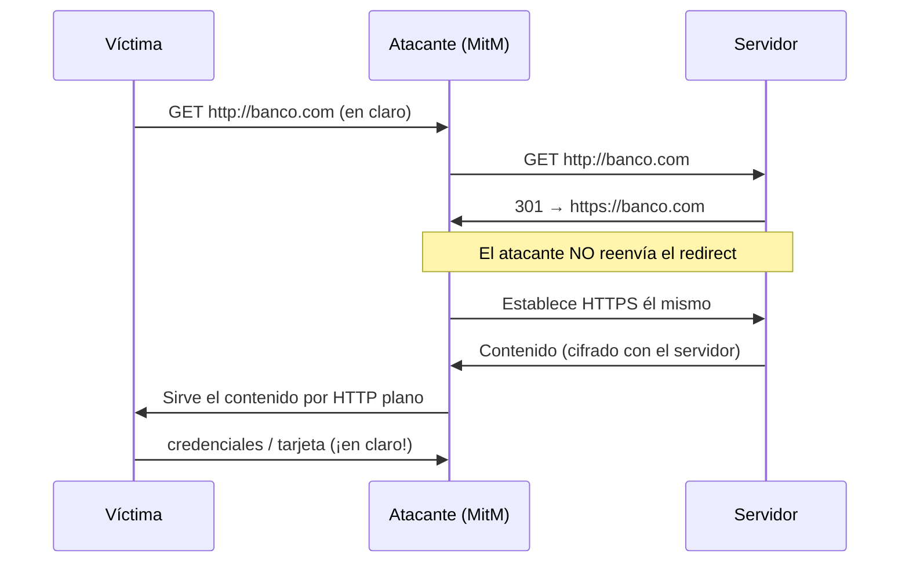

---
tags:
  - Web/Red-Team
  - Pentesting/Explotacion
  - TLS
Fecha de actualización: 2026-07-14
Nota previa: "[[07 - Heartbleed]]"
Nota siguiente: "[[09 - Primitivas criptográficas inseguras]]"
Area: "[[HTTPs-TLS.base|HTTPs/TLS]]"
---
---

En lugar de romper TLS, el **SSL Stripping** (o *HTTP downgrade*) fuerza a la víctima a **no usar HTTPS en absoluto** y comunicarse por [[HTTP]] plano. El atacante no descifra nada — hace que no haya nada que descifrar. <mark style="background: #FFB86CA6;">Requiere una posición de `man-in-the-middle`</mark>: capacidad de interceptar e inyectar mensajes entre víctima y servidor.

# Conseguir el MitM: ARP Spoofing

En una LAN, el protocolo **ARP** resuelve la dirección física (`MAC`) a partir de la IP. Cuando A quiere hablar con B, difunde un `ARP request` ("¿quién tiene 192.168.1.2?") y B responde con su MAC. A la cachea. <mark style="background: #ADCCFFA6;">El **ARP spoofing** envía respuestas ARP falsificadas</mark> para que la víctima guarde la MAC **del atacante** asociada a la IP del gateway/target. A partir de ahí, todo el tráfico de la víctima pasa por el atacante. Es difícil de detectar porque no altera la infraestructura.

```shell-session
# dsniff: hacerse pasar por 172.17.0.5 ante la víctima
$ sudo arpspoof -i docker0 172.17.0.5

# bettercap (más completo): envenenar y actuar
$ sudo bettercap -iface eth0
> set arp.spoof.targets 172.17.0.4
> arp.spoof on
```

`bettercap` restaura la caché ARP al parar (`arp.spoof off`), evitando limpieza manual. La víctima confirma el envenenamiento en su tabla `arp` (la MAC del gateway ahora es la del atacante).

> [!info] Contexto: dónde aplica esto
> ARP spoofing es un ataque de **red local** (pentest interno, WiFi abierta), no un bug web remoto. En una LAN también existen `DHCP spoofing`, `DNS spoofing` o `IPv6 RA` para lograr el MitM. La defensa de red es *Dynamic ARP Inspection* (DAI) en switches, entradas ARP estáticas y `arpwatch`.

# El ataque de SSL Stripping

Mantener el MitM y reenviar tráfico no basta: casi todos los servidores **redirigen HTTP → HTTPS**, y tras el handshake el atacante ya no ve el contenido. El truco del stripping es **partir la conexión en dos**:



Quedan <mark style="background: #ADCCFFA6;">dos conexiones separadas: víctima↔atacante en **HTTP plano**, y atacante↔servidor en **HTTPS**</mark>. Desde el servidor, todo llega por un túnel TLS válido — la conexión "es segura". Pero la víctima envía credenciales, cookies o datos de pago **en claro** al atacante. Es un robo de sesión **a nivel de transporte** que complementa los [[10 - Ataques a tokens de sesión|ataques a tokens de sesión]] de capa aplicación. La herramienta clásica es el `sslstrip` de Moxie Marlinspike (2009); hoy se usa el módulo de `bettercap`.

# Defensa: HSTS (y su punto ciego)

La cabecera **`Strict-Transport-Security` (HSTS)** instruye al navegador a acceder a ese dominio **solo por HTTPS**; cualquier intento HTTP se convierte a HTTPS o se rechaza, sin llegar a la red.

```http
Strict-Transport-Security: max-age=31536000; includeSubDomains
```

`max-age` es el tiempo (en segundos; aquí 1 año) que el navegador recuerda la política. `includeSubDomains` la extiende a todos los subdominios, incluso no visitados.

> [!warning] HSTS no protege la PRIMERA visita
> HSTS es *Trust-On-First-Use*: si el navegador **nunca** ha visitado el sitio, su primera petición puede ir por HTTP y ser strippeada. Ese hueco lo cierra la <mark style="background: #FFB8EBA6;">**HSTS preload list**</mark> ([hstspreload.org](https://hstspreload.org)): una lista **precargada en el propio navegador** (Chrome, Firefox, Safari) de dominios forzados a HTTPS desde el minuto cero, sin necesidad de visita previa. Un dominio serio debe estar en ella.

# Realidad 2026 y bypasses

El SSL stripping "clásico" es hoy mucho más difícil, pero no ha muerto:

- Los navegadores traen **HTTPS-First / HTTPS-Only mode** (Chrome, Firefox) y envían `Upgrade-Insecure-Requests`.
- **Bypass de HSTS con dominios look-alike** (`sslstrip2` de Leonardo Nve, caplet `hstshijack` de bettercap): si el sitio no usa `includeSubDomains` ni preload, el atacante redirige a subdominios/homoglifos no cubiertos (`wwww.` , `web.`) que sí acepta HTTP.
- Ataques a la noción de tiempo (NTP) para caducar el `max-age` de HSTS.

> [!success] Qué reportas en un pentest web
> Aquí no lanzas ARP spoofing (eso es red interna): el hallazgo web es la **ausencia o debilidad de HSTS**. Revísalo siempre:
> - Falta la cabecera `Strict-Transport-Security` → SSL stripping trivial.
> - HSTS sin `includeSubDomains` → subdominios strippables.
> - Dominio **no** en la preload list → primera visita vulnerable.
>
> ```shell-session
> $ testssl.sh --headers target.htb      # comprueba HSTS y su config
> $ curl -sI https://target.htb | grep -i strict
> ```
> Ver la auditoría completa en [[11 - Detección, testeo y hardening de TLS]]. Este ataque conecta con los [[10 - Downgrade Attacks|Downgrade Attacks]]: ambos degradan la seguridad forzando un canal más débil.

## Referencias

- [Moxie Marlinspike — sslstrip (Black Hat 2009)](https://www.thoughtcrime.org/software/sslstrip/)
- [hstspreload.org](https://hstspreload.org/)
- [bettercap — HSTS hijacking](https://www.bettercap.org/modules/ethernet/spoofers/arp.spoof/)
