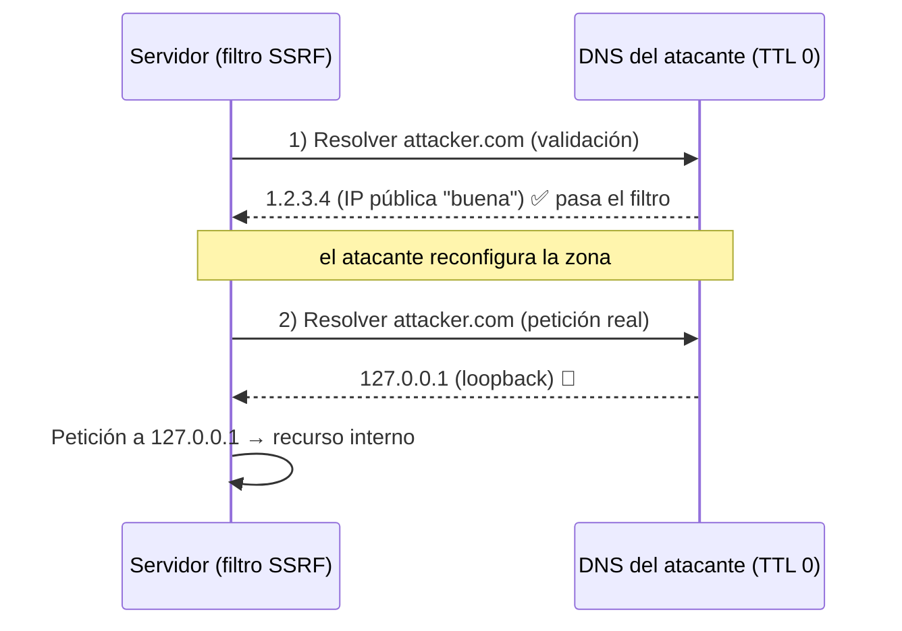

---
tags:
  - Web/Red-Team
  - Pentesting/Explotacion
  - Modern-Exploitation
Fecha de actualización: 2026-07-15
Nota previa: "[[00 - Introducción a Modern Web Exploitation Techniques]]"
Nota siguiente: "[[02 - Bypasses básicos de filtros SSRF]]"
Area: "[[Modern Exploitation.base|Modern Exploitation]]"
---
---

<mark style="background: #ADCCFFA6;">El `DNS Rebinding` abusa de que el atacante controla su propia zona DNS para cambiar la IP que resuelve un dominio **entre dos peticiones**</mark>. Sirve para saltar filtros [[00 - Introducción a los ataques server-side|SSRF]] que parecían correctos y la Same-Origin Policy del navegador. Antes, un repaso del DNS necesario.

# Recap: DNS, zonas y TTL

El [[02 - DNS - fundamentos|DNS]] resuelve nombres a IPs (`academy.hackthebox.com` → `104.18.21.126`) en una estructura de árbol. Las partes gestionadas por el mismo nameserver son **zonas DNS**. Lo crucial para el ataque:

- <mark style="background: #FFB86CA6;">El dueño de una zona administra libremente su DNS</mark>: añade/borra subdominios y, sobre todo, **reconfigura a qué IP resuelve** un dominio. Puede hacer que `www.inlanefreight.com` resuelva a `1.2.3.4` por la mañana y a `5.6.7.8` por la noche (útil para balanceo por DNS).
- Puede resolver a **cualquier** IP, aunque no le pertenezca — incluida `127.0.0.1` o una IP interna de la víctima.

El otro ingrediente es el **caching**. Repetir un lookup DNS antes de cada petición HTTP sería costoso, así que las respuestas se **cachean** durante un tiempo: el `TTL` (time-to-live), en segundos. Con `dig` lo vemos en la `ANSWER SECTION`:

```shell-session
$ dig A academy.hackthebox.com
;; ANSWER SECTION:
academy.hackthebox.com. 300 IN A 104.18.20.126
```

Aquí el `TTL` es **300 s** (5 min). <mark style="background: #FFB8EBA6;">Si configuramos un `TTL` muy bajo (p. ej. 1 s), forzamos a la víctima a re-resolver el dominio casi en cada petición</mark> — y ahí está la palanca del rebinding.

# El concepto: una condición de carrera sobre el DNS

Muchos filtros SSRF hacen esto: **resuelven** el dominio que les damos, comprueban que la IP **no** es interna, y si pasa, **hacen la petición**. El fallo: entre la comprobación y el uso hay **dos** resoluciones DNS distintas. Con un `TTL` de 0/1 s, controlamos qué devuelve cada una:



Es un <mark style="background: #8000E1A6;">`TOCTOU` (Time-Of-Check to Time-Of-Use)</mark>: en el **check** el dominio resuelve a una IP inocua; en el **use** ya resuelve a `127.0.0.1` o a una IP interna. El filtro validó una cosa y el servidor usó otra.

> [!important]+ Dos requisitos
> Para que funcione: (1) el atacante controla la **zona DNS** del dominio que da a la víctima (o usa un servicio de rebinding), y (2) el servidor hace la validación y la petición en **momentos separados**, re-resolviendo el DNS. Si el servidor resolviera **una sola vez** y reutilizara esa IP, el rebinding no aplicaría (por eso una de las mitigaciones es "pin" de la IP resuelta).

Antes de llegar al rebinding, en la siguiente sección repasamos los [[02 - Bypasses básicos de filtros SSRF|bypasses básicos de filtros SSRF]] (ofuscación de `localhost`, redirects…), que son la primera línea de ataque y el contexto donde el rebinding se vuelve necesario. El ataque de rebinding completo lo montamos en [[03 - DNS Rebinding para bypass de filtros SSRF|DNS Rebinding para bypass de filtros SSRF]].

## Referencias

- [Singularity of Origin — how DNS rebinding works](https://github.com/nccgroup/singularity)
- PortSwigger — [SSRF & DNS-based bypasses](https://portswigger.net/web-security/ssrf)
- OWASP — [SSRF Prevention Cheat Sheet](https://cheatsheetseries.owasp.org/cheatsheets/Server_Side_Request_Forgery_Prevention_Cheat_Sheet.html)
- HTB Academy — *Modern Web Exploitation Techniques* (base, 2023)
