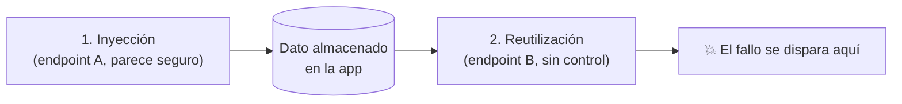

---
tags:
  - Web/Red-Team
  - Pentesting/Explotacion
  - Modern-Exploitation
Fecha de actualización: 2026-07-15
Nota previa: "[[05 - Herramientas, detección y prevención de DNS Rebinding]]"
Nota siguiente: "[[07 - Second-Order IDOR (whitebox)]]"
Area: "[[Modern Exploitation.base|Modern Exploitation]]"
---
---

<mark style="background: #ADCCFFA6;">Una vulnerabilidad de **segundo orden** ocurre cuando el input malicioso no dispara el fallo en el punto de entrada, sino **después**, cuando la app lo almacena y lo procesa en otro sitio</mark>. También se llama *second-order injection* o *delayed vulnerability*.

# Punto de inyección ≠ punto de disparo

La clave está en la **indirección**. El ejemplo más claro es el [[01 - XSS Almacenado|XSS almacenado]]: inyectas el payload al **enviar** un mensaje (que no es vulnerable en sí), y se dispara cuando **otro usuario lo abre** en un endpoint distinto. Inyección (enviar) y trigger (abrir) están separados.

<mark style="background: #8000E1A6;">Cualquier vulnerabilidad que requiera esta indirección es de segundo orden</mark>, y eso las hace **difíciles de detectar**:

- El punto de inyección **parece seguro** — lo pruebas, no pasa nada, y concluyes "no vulnerable".
- El fallo solo aparece al golpear un endpoint **diferente** que reutiliza el dato almacenado.
- <mark style="background: #FFB86CA6;">Requiere entender el funcionamiento **interno** de la app</mark>: qué se guarda, dónde se reutiliza, y qué controles hay (o faltan) en cada punto.

# Por qué importa (y por qué se escapan)

Un escáner automático que prueba cada parámetro de forma aislada **no** ve el segundo orden: manda el payload, ve una respuesta limpia, y pasa. El fallo requiere:

1. Almacenar el payload (endpoint A responde OK).
2. Provocar el flujo que lo reutiliza (endpoint B).
3. Observar el efecto en B (o en C, un tercer punto).

Por eso <mark style="background: #FFB8EBA6;">el segundo orden es terreno de pentest **manual** e informado</mark>, y de los hallazgos que más diferencian a un buen tester: hay que modelar cómo interactúan las funciones de la app, no solo fuzzear entradas.

# Las vulnerabilidades que veremos

Casi cualquier clase clásica tiene su versión de segundo orden. En este sub-tema:

| Vulnerabilidad | Versión de segundo orden |
| - | - |
| [[06 - Introducción a IDOR\|IDOR]] | El control de acceso se salta reutilizando un ID almacenado ([[07 - Second-Order IDOR (whitebox)\|whitebox]] / [[08 - Second-Order IDOR (blackbox)\|blackbox]]) |
| [[01 - Local File Inclusion (LFI)\|LFI]] | Una ruta almacenada se incluye después sin sanear ([[09 - Second-Order LFI\|Second-Order LFI]]) |
| [[00 - Introducción a Command Injection\|Command Injection]] | Input guardado que llega a un comando en otro flujo ([[10 - Second-Order Command Injection\|Second-Order Command Injection]]) |
| [[00 - Introducción a SQL Injection\|SQLi]] | El clásico: valor guardado (p. ej. en registro) usado en una query posterior — ver [[07 - SQL Injection de segundo orden\|SQLi de segundo orden]] |

> [!tip]+ Cómo cazarlo
> Marca tus inyecciones con un **canario único** (`SecondOrderTest_XYZ`) al almacenarlas, y luego **navega toda la app** buscando dónde reaparece ese canario: perfiles, logs, exports, PDFs, notificaciones, paneles de admin. Donde reaparezca sin sanear, ahí está el trigger. Herramientas como el *scanner* de Burp con *stored/out-of-band* ayudan, pero el modelado manual es insustituible.

Empezamos con el caso más didáctico: el [[07 - Second-Order IDOR (whitebox)|Second-Order IDOR desde whitebox]].

## Referencias

- PortSwigger — [Second-order / stored vulnerabilities](https://portswigger.net/web-security)
- HTB Academy — *Advanced SQL Injections* (segundo orden SQLi) y *Web Attacks* (IDOR)
- HTB Academy — *Modern Web Exploitation Techniques* (base, 2023)
