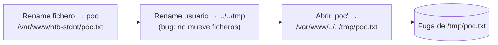

---
tags:
  - Web/Red-Team
  - Pentesting/Explotacion
  - Modern-Exploitation
Fecha de actualización: 2026-07-15
Nota previa: "[[08 - Second-Order IDOR (blackbox)]]"
Nota siguiente: "[[10 - Second-Order Command Injection]]"
Area: "[[Modern Exploitation.base|Modern Exploitation]]"
---
---

El [[01 - Local File Inclusion (LFI)|LFI]] normal es fácil de detectar (`../`). Pero cuando el punto obvio está filtrado, un LFI de **segundo orden** —construido combinando dos funcionalidades— pasa desapercibido. Aquí, cambiar el nombre de usuario altera la ruta desde la que se leen los ficheros.

# El código

La app (evolución de la de [[07 - Second-Order IDOR (whitebox)|IDOR]]) guarda los ficheros en el **filesystem**, en una carpeta con el nombre del owner:

```php
function fetch_data($id){
    // ...
    $owner = $result['owner'];
    $name  = $result['name'];
    $path = '/var/www/' . $owner . '/' . $name . '.txt';   // ruta = owner + name
    return array("name" => $name, "content" => file_get_contents($path));
}
```

Dos entradas influyen en `$path`: el **nombre del fichero** (`$name`) y el **owner** (= nuestro username). Atacamos cada una.

## El filename está filtrado

`edit_filename.php` rechaza `..`, `/` y `\`:

```php
$invalid = strpos($new_filename, '..') || strpos($new_filename, '/') || strpos($new_filename, '\\');
if($invalid){ /* logout */ }
```

Así que por el filename **no** podemos escapar de nuestro directorio. Vía muerta.

## El username NO está filtrado

`edit_username.php` no valida caracteres especiales. Y `update_username` tiene un **bug**:

```php
function update_username($user, $new_username){
    if (fetch_user_data($new_username)) return false;   // no puedes usar un nombre existente
    // actualiza users.username y data.owner ...
    // PERO no mueve los ficheros en disco
}
```

<mark style="background: #FF5582A6;">Al cambiar el username, la app actualiza la BD pero **olvida mover los ficheros** en el filesystem</mark>. Como la ruta de lectura se basa en el username, podemos redirigirla.

# Explotación

`$path = /var/www/<username>/<filename>.txt`. Como el username no se filtra, inyectamos `../` ahí. Plan para leer `/tmp/poc.txt`:

1. **Renombrar** un fichero nuestro a `poc` → se mueve a `/var/www/htb-stdnt/poc.txt`.
2. **Cambiar el username** a `../../tmp` → por el bug, **no** se mueve ningún fichero (ni se sobrescribe nada).
3. **Abrir** nuestro fichero `poc` → la app lo lee de <mark style="background: #8000E1A6;">`/var/www/../../tmp/poc.txt`</mark> = `/tmp/poc.txt` → nos filtra el fichero del sistema.



El punto de inyección (username) no parece un LFI; el filtro estaba puesto en el sitio "obvio" (filename). <mark style="background: #FFB86CA6;">El LFI emerge de la **interacción** entre dos funciones</mark>: una controla la ruta (username) y la otra la usa (lectura de fichero). Está limitado a `.txt` (la extensión está hardcodeada), pero sigue siendo un fallo de seguridad.

> [!tip]+ La señal whitebox
> Busca **rutas del filesystem construidas con múltiples entradas del usuario** donde el filtrado no cubre **todas**. Aquí, `$path` depende de `$owner` (username, sin filtro) y `$name` (filename, con filtro). Un control parcial —filtrar solo una de las variables que componen la ruta— es la firma del LFI de segundo orden.

# Prevención

- **Filtrar/normalizar TODAS** las entradas que componen una ruta, no solo la "obvia". Aquí faltaba el filtro en el username.
- Mantener **coherencia de estado**: si renombrar el usuario cambia la ruta lógica, debe mover los ficheros (o desacoplar la ruta física del username, usando IDs internos).
- Confinar la lectura con `realpath()` + verificación de que el resultado sigue dentro del directorio permitido ([[02 - Bypasses básicos - traversal, null byte y encoding|anti-traversal]]).

Cierre del segundo orden con el caso más sutil: la [[10 - Second-Order Command Injection|inyección de comandos de segundo orden]].

## Referencias

- HTB Academy — *File Inclusion* ([[01 - Local File Inclusion (LFI)|LFI]])
- OWASP — [Path Traversal](https://owasp.org/www-community/attacks/Path_Traversal)
- HTB Academy — *Modern Web Exploitation Techniques* (base, 2023)
