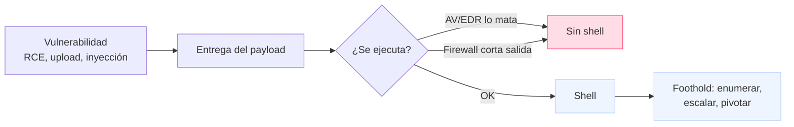

---
tags:
  - Pentesting/Explotacion
  - Shells
  - Payloads
  - Introduccion
Fecha de actualización: 2026-07-18
Nota previa: 
Nota siguiente: "[[01 - Anatomía de una shell]]"
Area: "[[Shells y Payloads.base|Shells y Payloads]]"
---
---

<mark style="background: #ADCCFFA6;">Una `shell` es un programa que ofrece una interfaz para enviar instrucciones al sistema operativo y leer su salida</mark> — `bash`, `zsh`, `cmd.exe`, `PowerShell`. En pentesting, "conseguir una shell" es <mark style="background: #FFB86CA6;">el momento en que una vulnerabilidad se convierte en control interactivo del host objetivo</mark>. La jerga del gremio lo dice sin rodeos: *"I popped a shell"*, *"I caught a shell"*, *"I'm in"*. Todas significan lo mismo: hemos logrado ejecución remota y ahora pilotamos el sistema como si estuviéramos sentados delante.

Ese salto —de *"existe un fallo"* a *"controlo la máquina"*— es el corazón de este sub-tema. No basta con demostrar que una entrada no se sanitiza; hay que **materializar** el acceso, mantenerlo y usarlo. Aquí es donde entran en juego dos conceptos que se confunden constantemente y conviene separar desde el principio.

# Shell y payload: dos piezas distintas

<mark style="background: #ADCCFFA6;">El `payload` es el trozo de código o comando que ejecutamos en el objetivo; la `shell` es el resultado que ese payload nos entrega</mark>. El payload es el *vehículo*; la shell es el *destino*. Un `reverse shell` de una línea con `bash`, un ejecutable generado con `msfvenom`, una `.aspx` subida a un servidor IIS o un módulo de Metasploit son todos payloads: distintas formas de conseguir lo mismo.

Separar ambos conceptos importa porque **fallan por motivos distintos**. Un payload puede ser correcto y aun así no darnos shell porque un firewall corta la conexión de salida, porque el `AV`/`EDR` lo detecta y lo mata en milisegundos, o porque el intérprete que asumimos (`python`, `bash`) no existe en el host. Diagnosticar "por qué no tengo shell" empieza por saber en cuál de las dos piezas está el problema.

# La taxonomía que cubre este sub-tema

Las shells se clasifican por **cómo se establece la conexión** y por **el canal que la transporta**. Son tres familias, y cada una tiene su nota:

| Tipo | Quién inicia la conexión | Cuándo se usa |
| --- | --- | --- |
| [[02 - Bind shells\|Bind shell]] | El atacante se conecta al objetivo (que escucha) | El objetivo tiene puertos accesibles y sin firewall de entrada |
| [[03 - Reverse shells\|Reverse shell]] | El objetivo se conecta al atacante | Lo habitual hoy: sortea NAT y firewalls de entrada |
| [[09 - Introducción a web shells\|Web shell]] | Vía HTTP contra un script subido al servidor | Servidores web; persistencia y sigilo sobre el puerto 80/443 |

Sobre esa base se cruza el **sistema operativo objetivo** —[[06 - Shells en Windows\|Windows]] y [[07 - Shells en Linux-Unix\|Linux/Unix]] tienen intérpretes, herramientas y controles de seguridad muy distintos— y la **generación de payloads**, manual ([[04 - Introducción a payloads\|one-liners]]) o automatizada ([[05 - Payloads con Metasploit y MSFvenom\|Metasploit y MSFvenom]]).

> [!info]+ Origen del sub-tema
> El material base procede del módulo **Shells & Payloads** de HTB Academy (path CPTS). Es un módulo con años a sus espaldas: buena parte de sus payloads son los mismos *one-liners* públicos que recopilan [PayloadsAllTheThings](https://github.com/swisskyrepo/PayloadsAllTheThings), [revshells.com](https://www.revshells.com) o [GTFOBins](https://gtfobins.github.io). Estas notas los conservan como referencia operativa, pero **actualizan** el enfoque a lo que funciona hoy frente a defensas modernas (`AMSI`, `EDR`, egress filtering) — desarrollado en [[11 - Detección, prevención y evasión]].

# La shell es el principio, no el final

<mark style="background: #FF5582A6;">Conseguir la shell es el *foothold* (punto de apoyo), no el objetivo del engagement</mark>. Una vez dentro, el trabajo real empieza: enumerar el host, [[2️⃣ Búsqueda de vulnerabilidades|buscar vías de escalada]], moverse lateralmente y cumplir los objetivos pactados. Por eso la **calidad** de la shell importa tanto como tenerla.

Una shell recién obtenida suele ser <mark style="background: #FFB8EBA6;">*no interactiva* o "tonta"</mark>: sin control de trabajos (`Ctrl+C` mata la sesión entera), sin autocompletado, sin `TTY`, sin poder usar `sudo`, `ssh` o editores a pantalla completa. <mark style="background: #8000E1A6;">Convertirla en una shell interactiva completa (`TTY` upgrade) es casi siempre el primer paso tras el acceso</mark> — lo tratamos en [[08 - Shells interactivas - upgrade a TTY]].

> [!warning]+ El lab miente sobre la facilidad
> En los laboratorios de HTB, lanzar un `nc -e /bin/bash` y recibir la shell funciona a la primera. En un objetivo real de 2026 ese mismo payload muere antes de conectar: `Microsoft Defender`/`CrowdStrike` lo detecta por firma, el firewall de salida solo deja pasar 80/443/53, y `nc` con `-e` ni siquiera está instalado. <mark style="background: #FFB86CA6;">La distancia entre "shell en el lab" y "shell en producción" es precisamente lo que separa a un principiante de un pentester</mark>, y es el hilo conductor de las notas de evasión y arsenal de este sub-tema.

# Encaje en el pentest

Conseguir una shell es la bisagra entre la fase de [[3️⃣ Explotación|explotación]] y la de [[4️⃣ Post-Explotación|post-explotación]]. La vulnerabilidad que la origina puede venir de cualquier sitio: una [[00 - Introducción a Command Injection|inyección de comandos]], una [[00 - Introducción a los File Upload Attacks|subida de archivos]] que permite web shell, un servicio de red vulnerable descubierto en [[00 - Principios y metodología de enumeración|enumeración]], o credenciales válidas reutilizadas. Este sub-tema no cubre *cómo encontrar* esas vulnerabilidades, sino **qué hacer con ellas para transformarlas en acceso interactivo fiable** — y cómo lograrlo sin que la infraestructura defensiva del cliente nos eche antes de empezar.

El recorrido: entender la [[01 - Anatomía de una shell|anatomía de una shell]], dominar los tres tipos de conexión, generar payloads a mano y con herramientas, adaptarlos a Windows y Linux, estabilizarlos, y —transversal a todo— saber cómo se detectan y cómo se evaden hoy. El [[12 - Arsenal de herramientas|arsenal moderno]] cierra el sub-tema con el *toolkit* que usa un pentester profesional para todo lo anterior.
