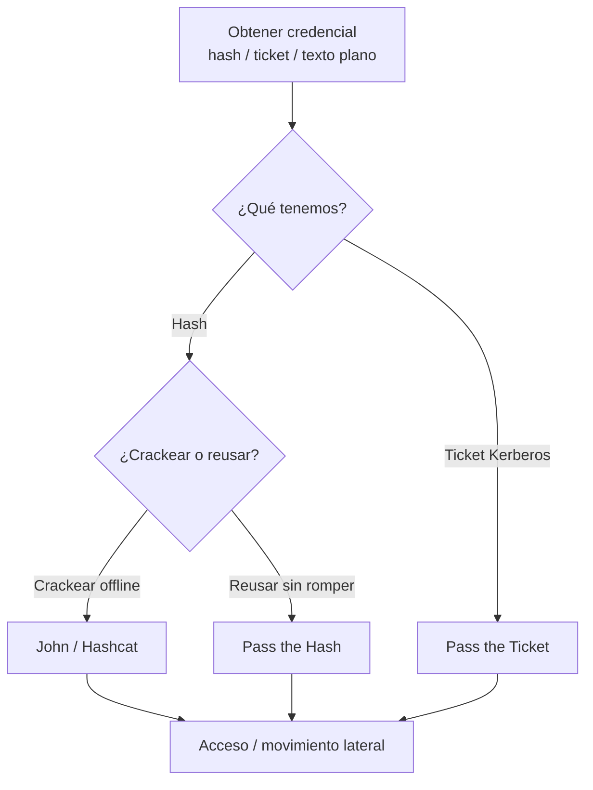

---
tags:
  - Seguridad/Contraseñas
  - Pentesting/Post-Explotacion
  - Introduccion
Fecha de actualización: 2026-07-18
Nota previa: 
Nota siguiente: "[[01 - Wordlists y reglas personalizadas]]"
Area: "[[Ataques a contraseñas.base|Ataques a contraseñas]]"
---
---

<mark style="background: #ADCCFFA6;">Las contraseñas siguen siendo el vector de compromiso nº1</mark>: credenciales débiles, reutilizadas o filtradas abren más redes que cualquier exploit. Este sub-tema cubre todo el ciclo — obtener credenciales, descifrarlas cuando hace falta, y reutilizarlas para moverse por la red.

# Hashing y salting

Los sistemas no guardan la contraseña en claro, sino su `hash`. <mark style="background: #ADCCFFA6;">Un hash es una función **unidireccional**: fácil de calcular, inviable de invertir</mark>. Al autenticar, el sistema hashea lo introducido y lo compara con el almacenado.

- **Rainbow tables**: tablas precomputadas de `contraseña → hash` que invierten un hash al instante… **si no hay salt**.
- **Salting**: se añade un valor aleatorio (`salt`) a cada contraseña antes de hashear. <mark style="background: #FFB86CA6;">El salt no es secreto, pero hace inútiles las rainbow tables</mark> (habría que precomputar una tabla por cada salt posible). Algoritmos modernos (`bcrypt`, `scrypt`, `Argon2`) integran salt y son deliberadamente lentos para frenar el cracking; `MD5`/`SHA1` sin salt son triviales de romper con GPU.

# Ataques offline vs. online

<mark style="background: #8000E1A6;">La distinción determina el ruido y la herramienta</mark>:

| | Offline | Online |
| --- | --- | --- |
| Qué | Crackear un hash **ya capturado** | Probar credenciales contra un **servicio vivo** |
| Herramientas | [[00 - Introducción a Hashcat\|Hashcat]], [[00 - Introducción a John the Ripper\|John]] | [[03 - Ataques remotos a servicios de red\|hydra, netexec]] |
| Detección | **Ninguna** (en tu máquina) | **Ruidoso**: logs de fallos, bloqueos de cuenta |
| Límite | Hardware/tiempo | [[04 - Password spraying, stuffing y defaults\|lockout policy]], rate-limit |

# Las técnicas de cracking

| Técnica | Idea |
| --- | --- |
| **Diccionario** | Probar una wordlist de contraseñas probables (`rockyou`) — lo más eficiente |
| **Reglas / híbrido** | Mutar la wordlist (capitalizar, `leet`, sufijos) — cubre las variaciones humanas |
| **Máscara** | Fuerza bruta dirigida por un patrón conocido (política) |
| **Fuerza bruta** | Todas las combinaciones — 100% efectiva pero inviable salvo para claves cortas |
| **Rainbow tables** | Inversión instantánea si no hay salt (hoy raro) |

# El flujo del pentester

# No siempre hay que crackear

<mark style="background: #FF5582A6;">Una idea clave: a menudo **no hace falta romper el hash**</mark>. En redes Windows/AD, el propio hash NTLM sirve para autenticarse ([[13 - Pass the Hash (PtH)|Pass the Hash]]), y un ticket Kerberos robado se reutiliza tal cual ([[14 - Pass the Ticket (PtT)|Pass the Ticket]]). Crackear es necesario cuando quieres la contraseña en claro (reutilización en otros servicios, informe) o cuando el hash no es directamente reutilizable (`sha512crypt` de Linux, hashes de aplicaciones).

El recorrido del sub-tema: [[01 - Wordlists y reglas personalizadas|preparar el cracking]], [[03 - Ataques remotos a servicios de red|atacar servicios]], **extraer** credenciales de [[06 - Ataque a SAM, SYSTEM y SECURITY|Windows]] y [[11 - Autenticación y credential hunting en Linux|Linux]], **reutilizarlas** ([[13 - Pass the Hash (PtH)|PtH]]/[[14 - Pass the Ticket (PtT)|PtT]]), y los ejes de [[17 - Detección y evasión|detección/evasión]] y [[18 - Arsenal de herramientas|arsenal]].
