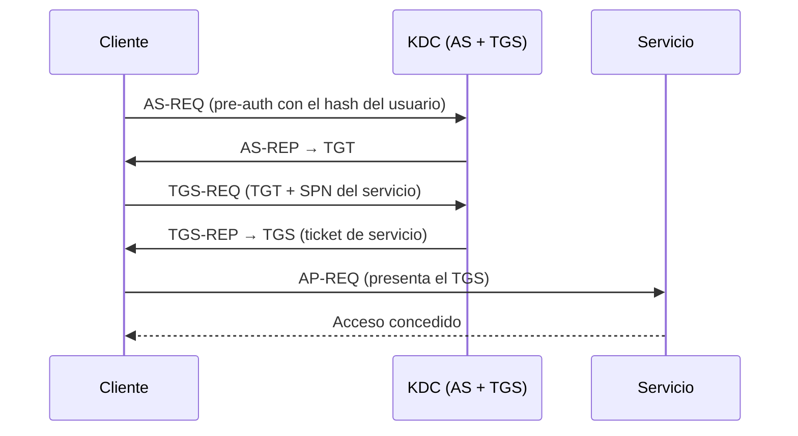

---
tags:
  - Seguridad/Contraseñas
  - Windows
  - Active-Directory
Fecha de actualización: 2026-07-18
Nota previa: "[[04 - Password spraying, stuffing y defaults]]"
Nota siguiente: "[[06 - Ataque a SAM, SYSTEM y SECURITY]]"
Area: "[[Ataques a contraseñas.base|Ataques a contraseñas]]"
---
---

Atacar credenciales en Windows exige entender **qué** se almacena, **dónde** y **cómo** se usa. De ahí salen todas las técnicas posteriores: qué robar, si crackearlo o reutilizarlo.

# Los "hashes" de Windows

| Tipo | Qué es |
| --- | --- |
| `LM` | Hash legacy, débilísimo — deshabilitado desde Vista, pero aparece en sistemas viejos |
| `NT` (NTLM) | El hash de la contraseña (MD4). <mark style="background: #FFB86CA6;">**Reutilizable tal cual** vía [[13 - Pass the Hash (PtH)\|Pass the Hash]]</mark> |
| `NetNTLMv1/v2` | Respuesta *challenge-response* del protocolo NTLM — **no** es el NT hash; se captura en red y se crackea o *relaya* |

<mark style="background: #FF5582A6;">Distinguir el `NT hash` (reutilizable) del `NetNTLMv2` (capturado en red, hay que crackear o relayar) es la confusión nº1</mark> y define qué ataque aplica.

# Dónde viven las credenciales

| Ubicación | Contenido | Nota |
| --- | --- | --- |
| `SAM` | Hashes NT de cuentas **locales** | [[06 - Ataque a SAM, SYSTEM y SECURITY]] |
| `LSASS` (memoria) | Credenciales de sesiones activas (hashes, a veces texto plano, tickets) | [[07 - Ataque a LSASS]] |
| `NTDS.dit` (DC) | Hashes de **todo el dominio** | [[09 - Ataque a Active Directory y NTDS.dit]] |
| `LSA secrets` | Credenciales de servicios, cuentas de máquina | [[06 - Ataque a SAM, SYSTEM y SECURITY]] |
| Credential Manager / DPAPI | Credenciales guardadas de apps/usuario | [[08 - Ataque a Credential Manager y DPAPI]] |

# NTLM: challenge-response

```mermaid
sequenceDiagram
    participant C as Cliente
    participant S as Servidor
    C->>S: NEGOTIATE
    S->>C: CHALLENGE (nonce aleatorio)
    C->>S: AUTHENTICATE (respuesta = f(NT hash, nonce))
    Note over C,S: El NT hash no viaja; sí una respuesta derivada = NetNTLMv2
```

<mark style="background: #8000E1A6;">Como la respuesta depende del NT hash, quien lo **posee** puede autenticarse sin conocer la contraseña</mark> — la base de Pass the Hash. Y quien **captura** la respuesta NetNTLMv2 en la red (con `Responder`) puede crackearla offline o *relayarla* a otro host.

# Kerberos: TGT y TGS

En un dominio, la autenticación por defecto es Kerberos, mediada por el `KDC` (el Domain Controller):



- El `TGT` (Ticket Granting Ticket) prueba tu identidad; el `TGS` da acceso a un servicio concreto.
- <mark style="background: #FFB86CA6;">Robar un ticket permite reutilizarlo ([[14 - Pass the Ticket (PtT)|Pass the Ticket]])</mark> sin conocer la contraseña.

# Por qué importa para el atacante

Cada pieza habilita un ataque:

- **NT hash** → [[13 - Pass the Hash (PtH)|Pass the Hash]] (reutilizar) o crackear (`-m 1000`).
- **NetNTLMv2** → crackear (`krb5`/`netntlmv2`) o *NTLM relay*.
- **TGS de servicio** → [[01 - Cracking en la práctica con John|Kerberoasting]] (`krb5tgs`, crackear offline la contraseña de la cuenta de servicio).
- **TGT/TGS robado** → Pass the Ticket.

Esta base sostiene todas las notas de extracción y reutilización que siguen, empezando por el objetivo más directo: la [[06 - Ataque a SAM, SYSTEM y SECURITY|SAM]].
